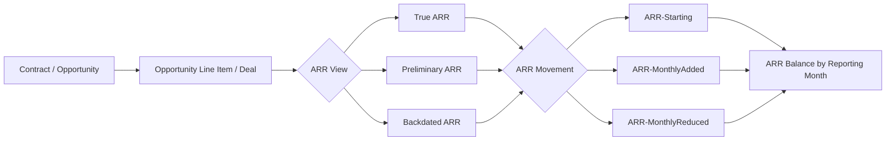
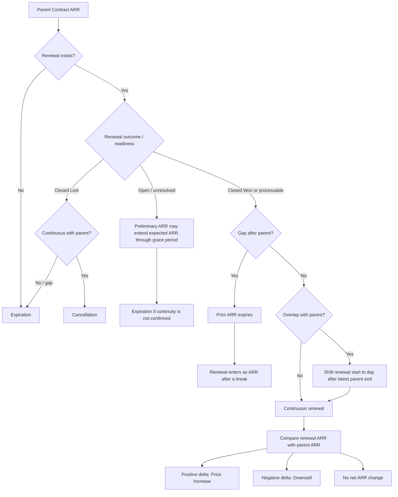
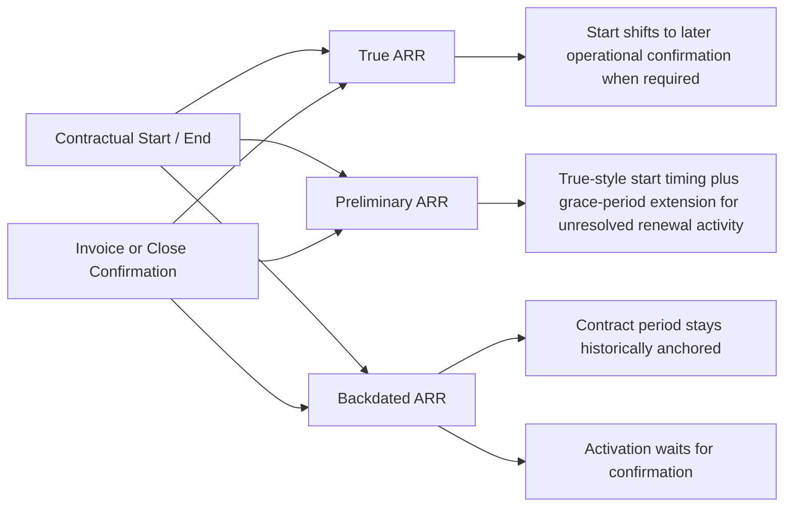

# Annual Recurring Revenue (ARR)

## Definition

**Annual Recurring Revenue (ARR)** is the expected recurring revenue Learning.com expects to receive from customers for providing recurring products or services on an annual, 12-month basis.

In business reporting, ARR represents the recurring contractual value that is active in a reporting period. It is not simply the recurring portion of a Deal at the time the Deal is sold. The ARR framework determines when recurring value becomes active, how it continues or changes across renewals, when it is reduced or removed, and how those changes should be explained month by month.

ARR is calculated independently for each fiscal year. At the beginning of a fiscal year, a **Starting ARR** baseline is established from contracts that are active on the last day of the previous fiscal year, normally June 30. During the fiscal year, ARR changes through business movements such as New Business, Upsell, Price Increase, Downsell, Cancellation, and Expiration.

Conceptually:

**Starting ARR + positive ARR movements − negative ARR movements = ARR balance**

The annual reset is intentional. It creates a stable fiscal-year baseline and reduces the effect of historical inconsistencies in contract configuration.

The ARR framework is designed to represent real business activity even when Salesforce contract data is imperfect. It accounts for delayed invoicing, open renewals, overlapping or gapped contracts, missing renewal timing, changes in products between parent and renewal contracts, and other operational inconsistencies.

---

## Distinction from Related Metrics

### Booking

**Booking** represents the total value sold through a successfully completed Deal. Booking can include both recurring and non-recurring portions of the Deal, including applicable multi-year amounts.

ARR differs from Booking because ARR includes only recurring value and is reported for each period in which that recurring value is active. Booking answers a question such as **“How much was sold?”** while ARR answers **“How much recurring contractual value is active in this reporting period, and why did it change?”**

### Opportunity / Deal ARR

**Opportunity / Deal ARR** is the recurring portion of the booked value of an Opportunity or Deal.

This is different from the monthly ARR framework:

- Opportunity / Deal ARR describes how much recurring value was sold in a specific Deal.
- Monthly ARR describes how much recurring value is active in a particular reporting month after applying timing, renewal, continuity, activation, reduction, and movement rules.
- The same Opportunity can contribute different ARR record types over time. For example, it may enter as Monthly Added in one fiscal year, be represented as Starting ARR in the next fiscal year, and later produce a reduction when it expires or is cancelled.

### NRR

**Non-Recurring Revenue (NRR)** represents non-recurring value, including one-time services and applicable multi-year amounts that are not treated as first-year ARR.

For paid-up-front multi-year subscription contracts, the first 12 months are treated as ARR and the remaining contract value is treated as NRR.

### Revenue

**Revenue** represents value recognized as earned during a reporting period.

ARR is not earned revenue. ARR represents recurring contractual value active during a period, while Revenue reflects recognition of value as products or services are delivered.

---

## ARR Views

The ARR methodology supports three complementary views. All three are derived from the same underlying business contracts and product lines, but they apply different rules for timing, confirmation, historical treatment, and unresolved renewal activity.

### True ARR

**Business purpose**

True ARR is the actuals-based ARR view. It is intended to represent recurring value only after the relevant operational event has been confirmed.

**Activation behavior**

For a Closed Won contract, ARR becomes reportable only after payment is confirmed through the **Invoiced Date**.

For a Closed Lost renewal, ARR reduction or cancellation becomes reportable only after the loss is confirmed through the **Close Date**.

**Start-date behavior**

True ARR begins from the contract start date unless operational confirmation occurs later.

- Closed Won: use the Invoiced Date if it is later than the contract start date.
- Closed Lost: use the Close Date if it is later than the contract start date.
- For renewals, the same principle applies using the renewal invoice or close date.
- Parent-to-renewal overlap rules may shift the renewal start date later.

**Historical treatment**

True ARR does not generally rewrite older reporting periods when Salesforce information changes later.

True ARR is recalculated from current source data, but standard reporting updates are limited to:

- the current month; and
- the first five days of the previous month.

After that window, previously reported True ARR is normally preserved for stability unless a specific business correction is requested.

**Grace period**

True ARR has no grace period.

**Business interpretation**

True ARR is the operationally confirmed recurring-revenue view. It intentionally avoids recognizing ARR before invoicing or confirmed cancellation.

---

### Preliminary ARR

**Business purpose**

Preliminary ARR is the expected operational ARR view. It is intended for recent or current reporting where renewal and payment information may still be incomplete.

**Activation behavior**

Preliminary ARR follows the same start-date logic as True ARR:

- Closed Won: use the Invoiced Date if it is later than the contract start date.
- Closed Lost: use the Close Date if it is later than the contract start date.
- Renewal overlap rules may shift the renewal start date later.

**Grace-period behavior**

Preliminary ARR can temporarily keep expected ARR active while payment, renewal, or cancellation information is still emerging.

Standard grace periods are:

| Contract / Account Type | Grace Period |
|---|---:|
| State / Biz Dev | 6 months |
| Texas accounts | 90 days |
| Other District accounts | 60 days |

If a renewal is still unresolved and the prior ARR would otherwise expire, Preliminary ARR may remain active through the applicable grace period.

If a renewal invoice or close event occurs before the grace-period end, the earlier confirmed event becomes the cutoff. This prevents Preliminary ARR from remaining active after a confirmed renewal or cancellation outcome.

**Historical treatment**

Preliminary ARR is designed for recent/current operational estimation, not broad historical restatement.

Standard reporting updates are limited to:

- the current month; and
- the first five days of the previous month.

Older periods are normally preserved unless a business correction is specifically requested.

**Business interpretation**

Preliminary ARR should be interpreted as expected operational ARR, not as a final actuals view. It deliberately tolerates unresolved renewal activity for a limited period.

---

### Backdated ARR

**Business purpose**

Backdated ARR is the adjusted historical ARR view. It is intended to align recurring value to the contractual period while still requiring operational confirmation before the ARR becomes reportable.

**Contract timing**

Backdated ARR is anchored to the original Salesforce contract start date rather than shifting the entire contract period to a later invoice or close date.

For renewals, parent-to-renewal continuity rules still apply. A renewal start may be shifted to the day after the latest parent contract end date when necessary to prevent overlapping ARR.

**Activation behavior**

Operational confirmation is stored separately from the contractual start:

- Closed Won: activation is the Invoiced Date.
- Closed Lost: activation is the Close Date.

This means Backdated ARR can ultimately appear in historical reporting from the contractual start period, but only after the confirming event has occurred.

**Historical treatment**

Backdated ARR can retroactively adjust historical periods when new confirmation information becomes available.

Standard recalculation is limited to a rolling 12-month window. Older periods outside that window are not normally rewritten automatically.

**Grace period**

Backdated ARR has no grace period.

**Business interpretation**

Backdated ARR answers a different question from True ARR. True ARR asks when recurring value became operationally confirmed. Backdated ARR asks where that confirmed recurring value belongs historically based on the contractual period.

---

## Source Business Objects

ARR is derived from business contracts represented in Salesforce as **Opportunities** and their associated **Opportunity Line Items / Deal product lines**.

### Contract / Opportunity

The Opportunity represents the customer contract or business transaction.

Contract-level information used to interpret ARR includes:

- contract Start Date;
- contract End Date;
- Opportunity status;
- Invoiced Date;
- Close Date;
- parent Opportunity relationships;
- renewal relationships;
- Account relationships.

### Opportunity Line Item / Deal Product Line

ARR value is derived from the value and classification of product lines within an Opportunity.

Product-line attributes can identify:

- recurring versus non-recurring value;
- business event such as New Business, Renewal, or Upsell;
- business model such as ARR or Biz Dev;
- Product and Product Category context;
- the value of the current contract line;
- the comparable value of the parent contract line.

A single Opportunity can contain a mixture of:

- ARR and Biz Dev lines;
- Renewal and Upsell lines;
- recurring and non-recurring revenue types;
- zero-dollar and non-zero-dollar lines.

Therefore, the Opportunity alone does not necessarily represent one uniform ARR classification.

### Contract Types

The framework recognizes important contract patterns:

- **State / Biz Dev** — revenue-generating contracts that may fund usage for other Accounts.
- **State Initiative** — zero-dollar contracts that grant product access but do not contribute ARR.
- **District / ARR** — standard revenue-generating contracts associated with licenses.

---

## Eligibility Rules

A contract must be sufficiently complete and operationally valid before it can participate in ARR.

### Closed Won contracts

A Closed Won Opportunity is ARR-eligible when it has:

- an Invoiced Date;
- a non-empty contract Start Date; and
- a non-empty contract End Date.

### Closed Lost contracts

A Closed Lost Opportunity participates in ARR cancellation logic only when:

- it is tied to a valid Won parent contract; and
- it has a Close Date.

### Product-line eligibility

Only product-line value intended to participate in ARR is included.

Important exclusions and limitations include:

- **State Initiative** zero-dollar access contracts do not contribute ARR.
- **Wire-transfer** product lines are excluded from ARR and are generally treated as NRR.
- **Negative** and **Replacement** Opportunities identified through Opportunity naming are not included in ARR by default.
- Non-ARR revenue types within a mixed Opportunity do not become ARR merely because the Opportunity itself participates in ARR.

### Contract duration

The ARR Framework states:

- contracts shorter than 12 months are prorated to annual values;
- multi-year contracts contribute only the first year to ARR;
- remaining applicable multi-year value is treated as NRR.

---

## Timing Rules

### Contract start and end dates

ARR is anchored to contractual timing, but the exact effective start depends on the selected ARR View.

The contract Start Date is the normal business starting point. Invoice Date, Close Date, renewal timing, parent-contract continuity, or ARR View rules may shift when ARR is recognized or reported.

The contract End Date normally determines when recurring value ends unless renewal, grace-period, activation/deactivation, or continuity rules modify that interpretation.

### True and Preliminary start-date adjustment

For True ARR and Preliminary ARR:

- Closed Won contracts use the Invoiced Date when it is later than the contract Start Date.
- Closed Lost contracts use the Close Date when it is later than the contract Start Date.
- Renewal contracts follow the same operational-date principle using the renewal invoice or close event.

This prevents ARR from being recognized before operational confirmation.

### Backdated start and activation

Backdated ARR keeps the original contract Start Date as its contractual anchor.

Operational confirmation is handled separately through activation:

- Closed Won → activation at Invoiced Date.
- Closed Lost → activation at Close Date.

This permits historical alignment without making ARR reportable before confirmation exists.

### Parent-to-renewal overlap prevention

A renewal must not overlap its ARR period with the parent contract.

If a renewal starts before the parent contract ends, the renewal effective start is shifted to:

**the day after the latest parent contract end date**

If one renewal replaces multiple parent contracts, the latest end date among those valid parents is used.

This rule prevents parent ARR and renewal ARR from being active at the same time.

### Renewal gaps

A gap is preserved rather than artificially closed.

If there is more than one day between the latest parent contract end date and the current renewal start date, the renewal is treated as ARR entering after a break.

A renewal after a gap is therefore not treated as uninterrupted continuation of the previous ARR.

### Missing renewal start date

If a renewal Start Date is missing, the framework defaults the renewal start to:

**the day after the parent contract end date**

This rule supplies renewal timing only in the specific parent-renewal context. It does not mean that every contract with missing start data is eligible; initial Closed Won contracts still require valid Start and End Dates.

### Reporting month assignment

The ARR reporting month is assigned from the adjusted effective start date after the applicable timing and continuity rules have been applied.

### Preliminary end-date extension

Preliminary ARR may extend the effective end of expected ARR using the applicable grace period.

The extension ends at the earliest applicable cutoff:

- the grace-period end;
- a renewal invoice event; or
- a renewal Close event.

### Expiration timing

Expiration represents removal of ARR associated with a contract that has ended when continuity has not been established.

Expiration can occur when:

- there is a gap before the renewal;
- there is no renewal; or
- a renewal exists but is not yet ready for processing.

The expiration month is based on the expired contract End Date.

For expiration records, the business event starts at the expired contract End Date. The expiration remains applicable until a renewal outcome or later timing rule supplies an end to that event.

When the renewal is confirmed:

- Closed Won renewal → expiration ends the day before the renewal Invoiced Date.
- Closed Lost renewal → expiration ends the day before the renewal Close Date.

### Activation and deactivation

ARR records are effective for reporting only during their applicable activation/deactivation period.

Conceptually, a record is reportable only when the reporting date falls between its activation and deactivation dates.

Activation and deactivation are especially important for Backdated ARR, but they are meaningful for all ARR Views because they prevent obsolete, unresolved, or superseded ARR events from remaining active indefinitely.

---

## Renewal and Continuity Rules

### Continuous renewal

A renewal is treated as continuous when there is no meaningful gap between the parent contract and the renewal.

For continuity testing, the framework compares:

- the adjusted renewal start date; and
- the latest parent contract end date.

If no gap exists, the renewal is considered continuous.

For a continuous renewal, the framework focuses on the **change** in recurring value between the parent and renewal rather than treating the full renewed value as entirely new ARR movement.

The resulting change may be represented as:

- Price Increase; or
- Downsell.

### Renewal after a gap

If there is more than one day between the latest parent contract end date and the renewal start date, continuity is broken.

The previous ARR expires, and the renewal is treated as ARR entering after a break rather than as uninterrupted continuation.

### Overlapping renewal

If a renewal begins before its parent contract ends, the renewal start is shifted to the day after the latest parent end date.

This prevents double counting.

### Renewal replacing multiple parents

One renewal Opportunity can replace multiple parent Opportunities that end on different dates.

For continuity and overlap handling, the framework uses the **latest valid parent contract end date**.

This avoids starting the renewal while any replaced parent ARR is still active.

### Missing renewal dates

If a renewal Start Date is missing, the framework defaults it to the day after the parent contract End Date.

### Contract without renewal

If a contract has no renewal, ARR expires naturally at the end of the contract period.

### Renewal not yet ready

When a renewal exists but has not yet reached a state where it can be processed, the prior contract may still produce an expiration event. Preliminary ARR may temporarily extend expected ARR through its grace-period logic.

### Closed Lost renewal

A Closed Lost renewal can create a Cancellation when:

- the renewal has a parent;
- there is no gap between the parent and renewal;
- the parent carried ARR; and
- the loss has been confirmed.

Where a gap exists, the prior contract is handled as expiration rather than cancellation of continuous ARR.

---

## ARR Movements

ARR reporting separates **movement records** from the **ARR balance**.

Movement records explain why ARR changed. The ARR balance represents the running recurring value after those movements are applied.

### ARR-Starting

**ARR-Starting** represents recurring value carried into the first fiscal month.

It is established from Opportunities that are active on the last day of the previous fiscal year, normally June 30.

A contract contributes to Starting ARR when June 30 falls within its adjusted active contract period.

Starting ARR is a fiscal-year baseline. It is not a new sale.

### ARR-MonthlyAdded

**ARR-MonthlyAdded** represents ARR entering or changing in the assigned reporting month.

It can include:

- New Business;
- Upsell;
- renewals entering after a gap;
- Price Increase for continuous renewals;
- Downsell for continuous renewals.

Although the name contains “Added,” the movement amount can be negative when the event represents a Downsell delta. The important distinction is that this record type captures contract-entry or renewal-change logic rather than expiration/cancellation removal.

### ARR-MonthlyReduced

**ARR-MonthlyReduced** represents ARR removed from reporting.

It is used for:

- Expiration; and
- Cancellation.

These events represent loss or removal of previously active recurring value.

### ARR balance

The **ARR** record type is the running monthly ARR balance after applicable Starting, Added, and Reduced movements have been applied.

The ARR balance answers:

**“How much ARR is active in this month?”**

Movement records answer:

**“Why did ARR change?”**

The movement records and ARR balance should not be interpreted as interchangeable measures.

---

## Movement Reasons / Buckets

The movement bucket explains the business reason behind a specific ARR record.

### Starting

**Starting** represents ARR already active at the fiscal-year boundary and carried into the first month of the new fiscal year.

Effect on ARR: positive opening balance contribution.

### New Business

**New Business** represents recurring value from a newly won business relationship or contract event classified as New Business.

Effect on ARR: positive contribution using the applicable ARR value.

### Renewal

**Renewal** identifies recurring value associated with renewal business.

Its reporting effect depends on continuity:

- after a gap, renewal value can enter as new ARR after the previous ARR expired;
- under continuous renewal, the framework generally focuses on the delta between parent and renewal so the entire contract is not treated as a new increase in company ARR.

The Renewal classification can therefore describe the business event even when the actual ARR movement is expressed through Price Increase or Downsell.

### Upsell

**Upsell** represents additional recurring business classified as expansion beyond the prior contract.

Effect on ARR: positive contribution.

Upsell classification is sourced from business classification in Salesforce, but its reliability is limited below the Opportunity level because Renewal versus Upsell is determined manually and then allocated across product lines.

### Price Increase

**Price Increase** represents a positive difference between a renewed recurring amount and the comparable parent recurring amount.

Conceptually:

**current recurring value − parent recurring value > 0**

Effect on ARR: positive delta only, not the entire renewed contract value.

### Downsell

**Downsell** represents a negative difference between a renewed recurring amount and the comparable parent recurring amount.

Conceptually:

**current recurring value − parent recurring value < 0**

Effect on ARR: negative delta only.

### Cancellation

**Cancellation** represents loss of previously recognized ARR when a renewal is Closed Lost and continuity exists with a valid parent contract.

The reduction reverses the applicable parent recurring value rather than using the lost renewal's current value.

Effect on ARR: negative contribution equal to the relevant parent ARR being lost.

### Expiration

**Expiration** represents removal of ARR when a contract reaches the end of its active period without an established continuous renewal.

Expiration can occur when:

- no renewal exists;
- there is a gap before the renewal;
- or a renewal exists but is not yet ready for processing.

Effect on ARR: negative contribution equal to the expiring recurring value.

Expiration and Cancellation are not synonyms. Cancellation reflects a confirmed lost renewal in a continuous parent-renewal relationship, while Expiration reflects ARR ending without confirmed continuous continuation.

---

## Business Rules

### Fiscal-year reset

ARR is calculated independently for each fiscal year.

At the beginning of the fiscal year, active recurring value from June 30 becomes Starting ARR. Movements during the new fiscal year are then applied to that baseline.

This annual reset is part of the business methodology and helps prevent old contract-configuration inconsistencies from compounding indefinitely.

### Annualized contract treatment

Contracts shorter than 12 months are prorated to annual values under the ARR Framework.

### Multi-year contract treatment

For multi-year contracts:

- only the first year contributes to ARR;
- applicable remaining multi-year value is treated as NRR.

### Operational confirmation

ARR should not become reportable before the relevant business confirmation exists.

Depending on ARR View, that confirmation may control:

- the effective start;
- the activation date;
- the cancellation date;
- or the end of Preliminary grace-period treatment.

### Parent-renewal non-overlap

Parent ARR and renewal ARR must not be active for the same period.

Overlap is resolved by shifting the renewal start to the day after the latest valid parent end date.

### Gaps remain visible

The framework does not force continuity when the business record contains a real gap.

A renewal after a gap is treated as recurring value re-entering after a break.

### Price changes are net changes

For comparable continuous parent-renewal value, Price Increase and Downsell represent the difference between current and parent recurring amounts, not the full renewal amount.

### Cancellation reverses parent ARR

Cancellation removes the relevant recurring value from the parent contract.

### Expiration removes current ARR

Expiration removes the recurring value associated with the contract that has ended.

### Mixed Opportunities

One Opportunity may contain multiple business models, revenue types, event classifications, Products, and both zero and non-zero values.

ARR interpretation must therefore consider the product-line classification rather than assuming the entire Opportunity has one uniform ARR meaning.

### Product continuity does not require identical Product IDs

A renewal can reference a different Salesforce Product ID from its parent while still representing the same broader Product Category for ARR comparison.

### Account hierarchy

Parent and renewal contracts can belong to different Accounts within the same hierarchy.

For business interpretation, aggregation at the Ultimate Parent / Customer level can be more meaningful than treating each contract Account as unrelated.

---

## Reporting and Interpretation Rules

### Monthly reporting behavior

ARR is reported as a monthly balance of recurring value that is active under the selected ARR View.

A monthly ARR balance is not the amount booked in that month and is not the amount of Revenue recognized in that month.

The same recurring contract value can appear as active ARR in multiple consecutive months.

### Why ARR changed

To explain an ARR change in a month, identify:

1. the **ARR View**;
2. the **record type**;
3. the **movement bucket**;
4. the Opportunity status;
5. the parent and renewal timing;
6. the activation/deactivation period.

The movement bucket explains the business reason:

- Starting;
- New Business;
- Renewal;
- Upsell;
- Price Increase;
- Downsell;
- Cancellation;
- Expiration.

### Balance versus movement

Movement records and balance records answer different questions.

- **ARR-Starting / ARR-MonthlyAdded / ARR-MonthlyReduced** explain change.
- **ARR** represents the running monthly balance after those changes.

Summing balance records across months does not produce a meaningful annual ARR total. Each monthly balance is a point-in-time / period-active measure.

### Multiple records from one Opportunity

A single Opportunity can create different ARR records over time.

For example, the same contract may:

- enter as Monthly Added when it first becomes active;
- become part of Starting ARR in the next fiscal year;
- later create a Monthly Reduced event when it expires.

Multiple ARR rows do not necessarily mean multiple distinct contracts.

### Reporting stability versus source corrections

The ARR source data is refreshed from current Salesforce information, but historical reporting is intentionally constrained.

Standard update windows are:

- True ARR: current month plus the first five days of the previous month;
- Preliminary ARR: current month plus the first five days of the previous month;
- Backdated ARR: rolling 12 months.

As a result, later corrections to invoice dates, Close Dates, contract dates, or relationship data do not necessarily rewrite all previously reported ARR periods.

This is intentional for reporting stability.

Historical corrections outside the standard update window can be made when there is a specific business need.

### Granularity limitations

ARR can be analyzed across business dimensions such as:

- reporting month;
- Opportunity / Contract;
- Account / Customer;
- Product;
- Product Sub-Family or broader Product grouping;
- movement bucket.

However, movement classifications are not equally reliable at every level.

The current business process determines **Upsell versus Renewal** manually at the Opportunity level and then allocates those classifications across product lines.

Because of this:

- the same Product may be split between Upsell and Renewal within one Opportunity;
- separate reporting of Upsell, Price Increase, or Downsell below the Opportunity level is not currently recommended;
- product-level or sub-family-level movement analysis should be interpreted with caution.

### Price-change comparison level

ARR change can be examined at several levels, including:

- Product;
- Product Sub-Family;
- Opportunity;
- Account.

The business result can differ depending on the comparison level because product composition may change between parent and renewal contracts.

The framework does not imply that every level produces an equally reliable classification.

---

## Ambiguities and Limitations

The ARR framework intentionally accounts for imperfect business processes rather than assuming contract data is clean.

### Payment timing can differ from contractual timing

Payments may be delayed or may occur out of sequence relative to contract Start and End Dates.

This is one reason True, Preliminary, and Backdated ARR exist as separate views.

### Renewal status may remain unresolved

Renewal Opportunities can remain open for extended periods.

This creates uncertainty about whether prior ARR should expire, continue temporarily, or later be replaced by confirmed renewal activity.

Preliminary ARR addresses this operational uncertainty through grace periods.

### Renewal timing is inconsistent

Renewals can:

- start early;
- start late;
- overlap parents;
- contain gaps;
- replace multiple parent contracts with different end dates.

The framework standardizes these cases but does not eliminate the underlying data-quality issue.

### Missing dates

Some Opportunities are missing key contract attributes.

Initial Closed Won Opportunities without required Start Date, End Date, or Invoiced Date are not sufficiently valid for ARR participation.

Missing renewal Start Dates can be filled using the parent end-date rule when a valid parent relationship exists.

### Renewal outcome may be unclear

Not all contracts have a clearly defined renewal outcome.

Until the outcome is confirmed, True, Preliminary, and Backdated ARR may behave differently.

### One renewal can replace several parents

A single renewal may replace multiple parent Opportunities whose contracts end on different dates.

The framework uses the latest parent end date to prevent overlap, but the underlying business structure remains complex.

### Mixed business models and revenue types

One Opportunity can combine ARR, Biz Dev, Renewal, Upsell, NRR, zero-dollar, and non-zero lines.

Opportunity-level interpretation can therefore hide important product-line differences.

### Product IDs can change across renewal

Parent and renewal contracts may use different Product IDs even when the business considers them part of the same Product Category.

Product-level matching should therefore not assume identical IDs always represent continuity.

### Upsell versus Renewal classification is not fully reliable

Upsell versus Renewal is determined manually at the Opportunity level and then allocated across Opportunity product lines.

This allocation can split the same Product between Upsell and Renewal within one Opportunity.

Because of this, separate reporting of Upsell, Price Increase, and Downsell below the Opportunity level is not considered fully reliable.

### Negative and Replacement Opportunities

Negative and Replacement Opportunities are not included in ARR by default.

They are not directly validated against NetSuite in the standard framework and are a known source of Salesforce-versus-NetSuite discrepancies.

They can be added when needed, but their exclusion should be understood when reconciling systems.

### Wire-transfer lines

Wire-transfer product lines are excluded from ARR and are generally categorized as NRR.

### Account hierarchy inconsistencies

Parent and renewal contracts can be associated with different Accounts within the same hierarchy.

Analysis at the Ultimate Parent / Customer level may therefore be more meaningful than a strict contract-Account comparison.

### Historical stability can preserve old inconsistencies

True and Preliminary ARR intentionally stop rewriting older periods after the standard update window.

Backdated ARR has a wider historical window, but standard automatic recalculation is still limited to 12 months.

Therefore, corrected source data does not automatically imply that every historical ARR value will be recalculated.

### True and Backdated views may not reconcile perfectly

In an ideal contract configuration, True ARR and Backdated ARR should converge when comparing appropriately confirmed periods.

In practice, small differences can remain because of contract configuration issues, date inconsistencies, relationship problems, and other source-data imperfections.

### Short-term contract treatment requires care

The authoritative ARR Framework states that contracts shorter than 12 months are prorated to annual values.

A separate business glossary example may describe the booked recurring value of a short-term Deal without annualizing it. These describe different contexts and should not be treated as interchangeable without confirming which metric definition is being used.

---

## Relationships

`derived_from → Contract / Opportunity`

ARR originates from customer contract activity represented as Opportunities.

`calculated_from → Opportunity Line Item / Deal`

ARR value and classification depend on the recurring value and business attributes of individual Deal product lines.

`associated_with → Account / Customer`

ARR can be analyzed by the contract Account and, where appropriate, by the broader Customer / Ultimate Parent hierarchy.

`associated_with → Product`

ARR can be associated with Products or broader Product groupings, although product-level movement classification has known limitations.

`reported_in → Reporting Month`

ARR is interpreted month by month based on adjusted timing, activation, deactivation, and movement rules.

`interpreted_through → ARR View`

True ARR, Preliminary ARR, and Backdated ARR provide different interpretations of timing and confirmation for the same underlying business activity.

`changes_through → ARR Movement`

Starting, Monthly Added, and Monthly Reduced movements explain how the ARR balance changes.

`continued_or_replaced_by → Renewal`

A parent contract can be continued, replaced, interrupted, or lost through renewal activity.

`compared_with → Parent Contract`

Continuous renewal price changes are interpreted by comparing current recurring value with comparable parent recurring value.

---

## Related Terms

### Contract / Opportunity

The business transaction representing the customer contract from which ARR timing, status, and renewal relationships are derived.

### Opportunity Line Item / Deal

The product-line component of an Opportunity. It carries recurring value and classifications used to determine ARR treatment.

### Booking

The total value sold through a Deal. Booking can include ARR and NRR and is normally attributed to a single reporting period based on the applicable Deal date.

### Opportunity / Deal ARR

The recurring portion of a booked Deal. It describes recurring value sold, not the monthly ARR balance after timing and renewal logic.

### NRR

Non-recurring value, including one-time services and applicable multi-year amounts beyond the first ARR year.

### Revenue

Value recognized as earned during the period when products or services are delivered.

### Parent Contract

The prior Opportunity whose recurring value, end date, and continuity relationship are used when interpreting a renewal.

### Renewal

A subsequent contract intended to continue or replace earlier recurring business.

### Invoiced Date

The operational confirmation date used to activate or shift ARR for Closed Won contracts, depending on ARR View.

### Close Date

The confirmation date used for Closed Lost renewals and cancellation timing.

### Starting ARR

The ARR baseline carried into the first month of a fiscal year from contracts active on the previous June 30.

### Price Increase

Positive recurring-value delta between a continuous renewal and its parent.

### Downsell

Negative recurring-value delta between a continuous renewal and its parent.

### Cancellation

Confirmed loss of previously recognized continuous ARR through a Closed Lost renewal.

### Expiration

Removal of ARR when a contract ends without an established continuous renewal.

### Activation / Deactivation

The effective reporting window during which an ARR record is considered active.

---

## Metric / Ontology Diagram

### ARR Framework

### Renewal, Timing, and Movement Logic

### ARR View Timing Interpretation

