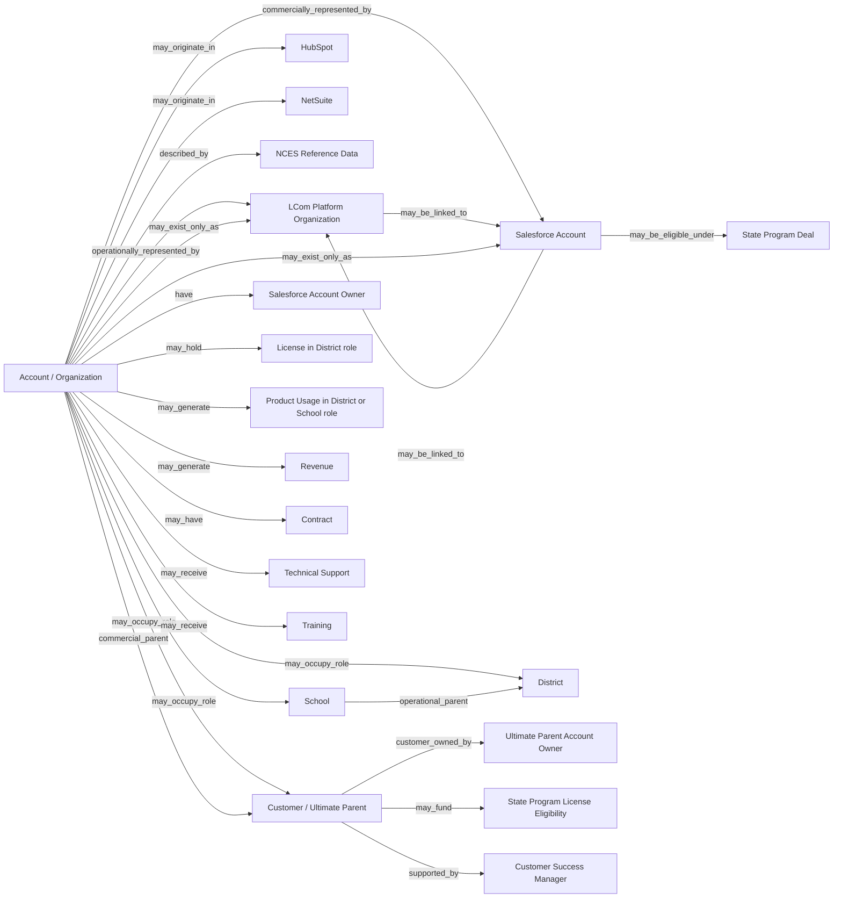

# Account / Organization

## Definition

An **Account / Organization** is the conformed representation of an organization that has, had, or may have a commercial, licensing, organizational, or product-usage relationship with Learning.com.

An Account / Organization can represent a public educational organization, such as a public school or district, or a commercial educational organization, such as a private school, summer camp, or after-school program.

An organization can participate in one or more relationships with Learning.com. It may

- purchase Learning.com products;
- hold licenses;
- contain users;
- consume LCom Platform lessons;
- open technical support cases;
- receive trainings;
- exist as a prospective organization;
- exist as a reference organization.

There is no single source-system representation of the Account / Organization entity within Learning.com. Its identity and hierarchy are distributed primarily between **LCom Platform Organizations** and **Salesforce **, with additional account creation or synchronization paths involving HubSpot and NetSuite.

The organization may originate in LCom Platform, Salesforce, or an integrated upstream system like HubSpot or may exist in only one system.

Its operational hierarchy and commercial hierarchy can differ. LCom Platform provides the primary view of school/district product organization, while Salesforce provides the primary view of the commercial Customer / Ultimate Parent relationship.

Historical, deleted, unlinked, duplicate, generic, and source-only organizations remain part of the account domain when required to preserve historical revenue, licensing, or usage activity.

The central complication of the Account / Organization entity is not merely duplicate matching. Learning.com has overlapping operational and commercial representations of the same organizational world, created at different times for different purposes and with different hierarchy rules. A usable account model has to preserve both rather than assume that either Salesforce or LCom alone completely defines what an Account is.

## Aliases

- **Account**
- **Organization**
- **Account / Organization**

The terms **school**, **building**, **district**, **account**, and **customer** are also used conversationally in ways that can overlap with Account / Organization terminology, but they are not interchangeable formal hierarchy definitions.

In particular:

- **building** may be used for a school;
- **account** may be used for a district;
- **customer** may be used for a district;
- the formal reporting definition of **Customer** is the Salesforce Ultimate Parent Account.

## Relationships

`operationally_represented_by → LCom Platform Organization`

LCom Platform represents the operational/product side of an organization. Its hierarchy governs licenses and product usage and is generally the stronger representation of the operational school/district relationship.

`commercially_represented_by → Salesforce Account`

Salesforce represents primarily the commercial side of an organization. It governs opportunities and revenue and is the current master system of record for commercial account information.

`may_be_linked_to → Salesforce Account`

An LCom Platform Organization may be linked to a Salesforce Account. The relationship is operationally established and can occur after either record has already been created. The two systems do not share a naturally enforced common identifier.

`may_be_linked_to → LCom Platform Organization`

A Salesforce Account may be linked to an LCom Platform Organization. A Salesforce-only Account can also exist without such a link.

`may_exist_only_as → LCom Platform Organization`

Some organizations exist in LCom Platform without a corresponding recognized Salesforce Account.

`may_exist_only_as → Salesforce Account`

Some organizations exist in Salesforce without a corresponding recognized LCom Platform Organization.

`may_originate_in → HubSpot`

An Account can be originated in HubSpot and subsequently be moved or synchronized into Salesforce through the HubSpot–Salesforce integration.

`may_originate_in → NetSuite`

It is theoretically possible for an organization to originate through NetSuite and subsequently become represented in Salesforce. It is not currently known whether this occurs in practice.

`described_by → NCES Reference Data`

Public and private educational organization data from NCES is periodically loaded into Salesforce and is available as descriptive Account attributes. NCES data does not replace either the operational LCom hierarchy or the commercial Salesforce hierarchy.

`may_occupy_role → School`

A public educational organization can occupy the lowest organizational role commonly interpreted as School.

`may_occupy_role → District / Operating Parent`

An organization can occupy the District / Operating Parent role. A district can simultaneously occupy the Account / Organization role and the District role.

`may_occupy_role → Customer / Ultimate Parent`

An organization can occupy the Customer role when it is the Salesforce Ultimate Parent Account.

`operational_parent → District / Operating Parent`

In the typical public-education operational hierarchy, a school belongs to a district. LCom Platform is generally the stronger representation of this relationship.

`commercial_parent → Customer / Ultimate Parent`

For business reporting, the commercial hierarchy resolves to the Salesforce Ultimate Parent Account, which is the formal Customer.

`have → Salesforce Account Owner`

Every individual Salesforce Account can have its own Account Owner. Ownership belongs to the individual account rather than inherently to the entire hierarchy.

`supported_by → Customer Success Manager`


`customer_owned_by → Ultimate Parent Account Owner`

For customer-level reporting, the Ultimate Parent Account Owner can practically serve as the conformed Customer Owner because ownership differences across commercially relevant hierarchies were extremely rare in the August 2026 analysis.

`may_hold → License in District role`

Licenses are associated with LCom districts. License ownership does not by itself define the commercial Customer or organizational level.

`may_generate → Product Usage in District or School role`

Users can generate product usage under schools, districts, or generic school-level LCom Organizations. Product usage does not by itself define the organization's commercial role or hierarchy level.

`may_generate → Revenue`

Revenue can exist at a school, district, intermediate Salesforce organization, or Ultimate Parent because opportunities are not consistently maintained at one hierarchy level.

`may_have → Contract`

Salesforce Opportunities and other Salesforce objects can be associated with Accounts at different hierarchy levels.

`may_receive → Technical Support`

An Account / Organization can have technical support relationships independently of whether it currently has revenue, licenses, or product usage.

`may_receive → Training`

An Account / Organization can receive trainings independently of whether it currently has revenue, licenses, or product usage.

`may_fund → State Program License Eligibility`

A State Program Deal customer can provide the commercial basis for licenses that are consumed by other organizations, such as districts and schools.

`may_be_eligible_under → State Program Deal`

A Salesforce Account at school or district level can be manually marked as eligible to consume licenses and generate usage under a State Program Deal.

## Business Rules

### Operational and Commercial Representations

- LCom Platform is the primary operational/product representation of organizations.
- Salesforce is primarily the commercial representation of organizations.
- Neither source alone completely defines the Account / Organization entity.
- The LCom hierarchy is generally the stronger representation of the operational school/district relationship because it governs licenses and product usage.
- Salesforce Ultimate Parent is the stronger representation of the commercial Customer relationship because Salesforce governs opportunities and revenue.
- A disagreement between LCom and Salesforce hierarchy levels does not necessarily mean that one entire hierarchy is wrong. The systems represent organizations for different purposes.

### LCom Platform Hierarchy

The LCom Platform hierarchy has two primary levels:

```text
District
   ├── School
   ├── School
   └── School
```

- Licenses are associated with districts.
- Users, including students, teachers, and district coordinators, can be associated with either a district or a school.
- Usage is predominantly school-level, but school-level usage does not necessarily represent a physical school.
- District users can generate usage under the district organization itself.
- District users can also generate usage under a generic school-level organization created to represent school-level usage for district users.
- Generic school-level organizations can have names such as `Cloud`, `*cloud`, or similar variants.
- A school-level LCom Organization must not automatically be interpreted as a physical school.

### LCom Organization Deletion and Historical Activity

- LCom Organizations can be effectively soft-deleted through naming conventions rather than physically removed.
- Soft-deletion naming can use variations of `z`, `Z*`, `do not use`, and combinations with inconsistent capitalization.
- Historical usage remains associated with these organizations.
- An apparently obsolete or soft-deleted LCom Organization remains part of historical account identity when needed to preserve historical activity.
- Such organizations cannot simply be excluded from the account universe because of their names.

### Salesforce Hierarchy

For public education, the natural Salesforce hierarchy is generally:

```text
District / Ultimate Parent
   ├── School
   ├── School
   └── School
```

- Private organizations and other account types can have multiple intermediate levels between the lowest-level organization and the Ultimate Parent.
- Opportunities are preferably maintained at district level for public schools, but this is not consistently enforced.
- Revenue can therefore exist at a school, district, intermediate organization, or Ultimate Parent.
- A district can have some opportunities associated directly with the district and other opportunities associated with individual schools.

### Customer

The term **Customer** is used in two related but distinct ways:

#### Customer / Ultimate Parent — hierarchy role

- In the Account hierarchy, **Customer = Salesforce Ultimate Parent Account**.
- Customer in this sense identifies the highest commercial parent used to group Accounts for reporting. It does **not by itself mean that the organization is currently an LCom Customer**.
- Several schools or other Accounts can therefore roll up to the same Customer / Ultimate Parent.
- An individual school with its own active contract, revenue, licenses and product usage is not treated as the Customer when it belongs to a higher-level District or Ultimate Parent.

#### LCom Customer — business status

- When answering business questions such as **“How many Customers does Learning.com have?”**, an organization is counted as an LCom Customer only when its Customer / Ultimate Parent has **non-zero ARR from active contracts**.
- A Customer whose ARR becomes **$0** is considered **churned**.
- An Account can therefore exist in the Customer / Ultimate Parent hierarchy without currently being counted as an LCom Customer.
- Public districts and schools that receive licenses and use Learning.com products through a **State Program Deal** are not counted as individual LCom Customers unless they have their own active contracts contributing non-zero ARR. They are license holders/product users under the State Program relationship and cannot themselves churn from that relationship.
- Consequently, having an Account, holding licenses, or using Learning.com products does not by itself make an organization an LCom Customer.

### Salesforce Ownership

- Every individual Salesforce Account can have its own Account Owner.
- The individual Account Owner remains relevant for account-level ownership.
- Analysis of current account data in August 2026 found that, among accounts with contracts, differences between the individual Account Owner and the Ultimate Parent Account Owner were approximately 0.2%.
- Based on that observed consistency, the Ultimate Parent Account Owner can practically serve as the conformed Customer Owner for customer-level reporting.
- The observed 0.2% difference is evidence supporting the practical convention, not a rule that individual and Ultimate Parent ownership must always be identical.

### Account Origins and Commercial Master

- Salesforce is the current master system of record for commercial account information.
- A Salesforce Account was not necessarily originally created in Salesforce.
- Accounts can originate in HubSpot and later move or synchronize into Salesforce.
- Salesforce is integrated with NetSuite.
- It is theoretically possible that an organization could originate through NetSuite and later be represented in Salesforce, but whether this occurs in practice is currently unknown.

### Historical Evolution

- LCom license and usage history extends to 2020 and earlier.
- Before approximately 2024, commercial information was maintained exclusively in NetSuite and was subsequently imported into Salesforce.
- Since that migration, Salesforce has been the commercial master system.
- Older imported Accounts and relationships can contain more inconsistencies.
- Processes after 2024 impose more structure, but they still do not prevent incorrect hierarchy assignments, duplicate Accounts, missing relationships, or other inconsistencies.
- Account and hierarchy data change over time.
- Reporting generally uses the current organization, hierarchy, and ownership as the best available representation.
- Historical changes are retained in the data warehouse from May 2025 primarily for traceability rather than historical account reporting.

### Cross-System Identity

- LCom Organizations and Salesforce Accounts do not share a naturally enforced common identifier.
- Their relationship can be established after either record already exists.
- An organization can first appear in LCom or Salesforce and be linked later.
- The account domain can legitimately contain:
  - organizations linked in both systems;
  - LCom-only organizations;
  - Salesforce-only Accounts;
  - similar organizations in both systems without a recognized link;
  - duplicates;
  - potentially incorrect historical links;
  - disagreements about organizational level between systems.
- A Salesforce school can be linked to an organization represented as a district in LCom, or vice versa.
- Cross-system hierarchy disagreement must not automatically be interpreted as proof that one source hierarchy is globally incorrect.

### NCES

- NCES - https://nces.ed.gov/ - is a federal agency within the Department of Education that currently compiles and standardizes data from all public schools, private schools, and universities in the United States.  In particular, their Common Core of Data - https://nces.ed.gov/ccd/ - is an expansive annual survey that is undertaken every year and publicly published with demographic, funding, geographic, and unique identifier information for all of these entities.  
- This data feeds into SAlesforce via our provider, Agile Education Marketing - https://agile-ed.com/ - to automatically fill in this information and create Accounts.  LCom use this data to determine many of our business rules around Sales Territory, Sales Owner, Opportunity size, etc.   
- NCES ID is used in LCom Platform as the unique identifier that ties back Organizations in our product back to their real-world entities.


### District Deals

- Most customers came from District Deals in which the customer pays for and uses Learning.com products itself.
- These customers typically generate revenue, hold licenses, and generate usage.
- Revenue, license ownership, and usage can coincide in this pattern, but their coincidence is not a universal definition of an Account / Organization role.

### State Program Deals

- A State Program Deal customer can pay for Learning.com products without necessarily using the products itself.
- A state Department of Education can hold the Salesforce contract and revenue while individual districts receive licenses and generate usage.
- Districts covered by a State Program Deal can legitimately have licenses and substantial usage with $0 district-level Salesforce contracts and revenue.
- Conversely, a State Program Deal account can have non-zero revenue but no corresponding LCom licenses or usage.
- Salesforce opportunities with monetary amounts provide the commercial basis for licenses to be created for eligible districts and schools.
- Salesforce contains a manually maintained flag indicating whether an Account at school or district level is eligible to consume licenses and generate usage under a State Program Deal.
- The eligibility flag can be turned off when there is no currently active State Program Deal.
- The eligibility flag does not establish a physical relationship between an eligible Account and the Salesforce Account or Opportunity that funds it.
- For large State Program Deals, the relationship between the paying organization and eligible consuming districts/schools is generally understood from business knowledge. Eligible organizations are expected to be in the state whose Department of Education purchased the program, and the relevant state deal is widely known internally.
- The large State Program relationship is not represented by a direct Salesforce Account or Opportunity attribute.
- For smaller or more complex deals, the method used to determine eligibility is less clear and may depend primarily on operational or institutional knowledge.
- Smaller or more complex umbrella relationships may not necessarily be represented by the State Program eligibility flag.
- The State Program eligibility flag is more directly useful for analyzing license and usage eligibility than for establishing a reliable revenue-to-consuming-account relationship.
- State Departments of Education are the largest contributors to State Program Deal revenue.
- Similar umbrella relationships can also exist between other organizations, including commercial educational organizations with more complex structures.

### Overlapping Commercial Relationships

- An organization can hold a State Program Deal that funds licenses for other organizations while also having separate opportunities that fund its own licenses or usage.
- A district or school covered by a State Program Deal can also have its own opportunities for other products, services, or additional coverage.
- The exact business interpretation of mixed deal patterns cannot always be determined from Account attributes alone.
- Some mixed-deal meaning is derived from Opportunity deal types and organizational knowledge.

### Trials and Demos

- An organization can have trial/demo licenses or usage without a commercial Salesforce Account.
- An organization can have a corresponding trial/demo commercial record with $0 district-level Salesforce contracts and revenue.
- Trial/demo patterns are legitimate combinations and must not be interpreted automatically as missing revenue or broken account relationships.

### Revenue, Licenses, and Usage

> **Revenue, license ownership, and product usage are related aspects of an organization, but none of them individually defines the role of the organization and the level it occupies.**

The existence or absence of any one of these aspects must not be used by itself to infer whether an organization is a School, District, Customer, paying organization, consuming organization, or another role.

### Practical Organizational Roles

For analytical purposes, an organization can be viewed through three roles:

```text
Account / Organization
        ↓
District / Operating Parent
        ↓
Customer / Ultimate Commercial Parent
```

For the typical lowest public-education level:

```text
School → District → Customer
```

These are roles, not necessarily three different physical organizations.

Valid patterns include:

```text
District X → District X → Customer Y
```

A district occupies both Account and District roles.

```text
District X → District X → District X
```

A public-school district that is itself the Ultimate Parent Customer occupies all three roles.

```text
School A → District X → District X
```

A school occupies the lowest role, while its district occupies both District and Customer roles.

Private organizations can have structures that do not correspond literally to public-school terminology.

## Ambiguities

### Cross-System Identity and Matching

There is no naturally enforced common identifier between LCom Organizations and Salesforce Accounts. Similar organizations can exist in both systems without a recognized link, and records can be linked after creation.

The source does not define a universal rule for deciding when an unlinked LCom Organization and Salesforce Account represent the same real-world organization.

### Conflicting Hierarchy Levels

LCom and Salesforce can disagree about whether an organization is represented as a school or district.

A Salesforce school can be linked to something represented as a district in LCom, or vice versa.

The source explicitly cautions against interpreting these disagreements as evidence that one entire source hierarchy is wrong. Each system describes organizations for a different business purpose.

### Physical School vs. Generic School-Level Organization

A school-level LCom Organization is not necessarily a real physical school. Generic school-level organizations can be created to hold usage for district users.

The name patterns `Cloud`, `*cloud`, or similar variants are examples rather than a complete formal classification rule.

### Soft-Deleted LCom Organizations

Soft-deletion is represented through inconsistent naming conventions such as variations of `z`, `Z*`, and `do not use`.

The source does not define an exhaustive list of deletion-name patterns. Therefore, these examples must not be treated as a complete deterministic classification.

### NetSuite-Originated Accounts

Salesforce is integrated with NetSuite, and an organization could theoretically originate through NetSuite and later appear in Salesforce.

It is not currently known whether this occurs in practice.

### Older Imported Account Quality

Older Accounts and relationships imported from the pre-2024 NetSuite commercial environment can contain more inconsistencies.

The source does not provide a deterministic rule for identifying which specific relationships are incorrect or how they should be repaired.

### Historical vs. Current Hierarchy

Account and hierarchy changes are retained from May 2025, but business reporting generally uses the current hierarchy and ownership as the best available representation.

The retained history is primarily for traceability, not a requirement that historical reporting reconstruct the hierarchy as it existed at each historical date.

### State Program Revenue-to-Consumer Relationship

The State Program eligibility flag indicates eligibility to consume licenses and generate usage but does not reliably identify which paying Salesforce Account or Opportunity funds the eligible organization.

For large State Program Deals, this relationship is commonly understood through state alignment and institutional knowledge rather than a direct Salesforce relationship.

For smaller or more complex deals, the method used to determine eligibility is less clear and may depend on operational or institutional knowledge.

The source does not define a universal deterministic method for connecting every consuming organization to the revenue source that funds it.

### Mixed Deal Patterns

Organizations can simultaneously participate in State Program funding relationships and direct commercial opportunities.

The exact business meaning of these combinations cannot always be determined from Account attributes alone. Opportunity deal types and organizational knowledge can be necessary.

### Terminology

Internal use of *school*, *building*, *district*, *account*, and *customer* is not always precise.

The formal Customer definition is clear, but conversational terminology must not be assumed to encode a hierarchy level without additional context.

### Customer Owner Convention

The Ultimate Parent Account Owner is a practical conformed Customer Owner because current August 2026 analysis found approximately 0.2% disagreement among accounts with contracts.

This is an evidence-based reporting convention, not an assertion that individual Account Owner and Ultimate Parent Account Owner are universally identical.

### Account identification by name can be ambiguous

Different organizations, particularly districts in different states or schools in different districts, may have identical or similar names. Business users may also refer to an account by an abbreviation, shortened name, or only part of its official name. The **state and other account context should be verified** when identifying a specific organization.

## Related Terms

### LCom Platform Organization

The operational/product representation of an organization in LCom Platform. Its hierarchy primarily represents districts and schools and governs licenses and product usage.

### Salesforce Account

The commercial representation of an organization in Salesforce. Salesforce is the current commercial master system, but a Salesforce Account may have originated elsewhere.

### School

The typical lowest public-education organizational role. A school can generate usage and can also have Salesforce opportunities. A school-level LCom Organization is not necessarily a physical school.

### Building

A term that refer to a school.

### District / Operating Parent

The operational parent role for schools. In LCom Platform, licenses are associated with districts. A district can also be the commercial Customer.

### Customer / Ultimate Commercial Parent

The formal Learning.com reporting Customer. Defined as the Salesforce Ultimate Parent Account.

### Salesforce Account Owner

The owner assigned to an individual Salesforce Account.

### Customer Owner

The conformed owner used for customer-level reporting. Practically represented by the Salesforce Ultimate Parent Account Owner, based on the observed high ownership consistency across commercially relevant hierarchies.

### Customer Success Manager (CSM)

A Customer Success Manager (CSM) is a person who helps LCom Customers get the most value from the LCom Platform.

For current reporting, CSM is primarily used as a Customer-level reporting/filtering attribute.

### Ultimate Parent Account

The Salesforce Account at the top of the commercial hierarchy. It defines the formal Customer for Learning.com reporting.

### Opportunity

A Salesforce commercial object that can be associated with Accounts at different hierarchy levels. Opportunity placement is not consistently limited to district level.

### District Deal

A commercial pattern in which the customer generally pays for and uses Learning.com products itself, so revenue, licenses, and usage commonly occur within the same customer organization.

### State Program Deal

A commercial pattern in which the paying organization can differ from the organizations that receive licenses and generate usage. A state Department of Education is a major example of the paying organization.

### State Program Eligibility

A manually maintained Salesforce indication that a school- or district-level Account is eligible to consume licenses and generate usage under a State Program Deal. It does not establish a reliable direct relationship to the Account or Opportunity that funds the usage.

### License

A product entitlement associated with LCom districts. License ownership is related to organizational role but does not independently define Customer or hierarchy level.

### Product Usage

Consumption of LCom Platform lessons. Usage is predominantly school-level but can occur under districts or generic school-level organizations.

### Generic School-Level Organization

An LCom Organization created at school level to represent usage for district users rather than necessarily representing a physical school. Names can include `Cloud`, `*cloud`, or similar variants.

### NCES Reference Data

Public and private educational organization information periodically loaded into Salesforce as descriptive Account attributes. It supplements but does not replace Learning.com's operational or commercial hierarchies.

### HubSpot

An upstream system from which Accounts can originate before being synchronized into Salesforce.

### NetSuite

The former commercial system and an integrated system with Salesforce. Commercial information before approximately 2024 was maintained exclusively in NetSuite and later imported into Salesforce.

### Trial / Demo Organization

An organization that can have licenses or usage without a normal revenue relationship. It may lack a commercial Salesforce Account or have a $0 commercial record.

## Ontology Diagram
