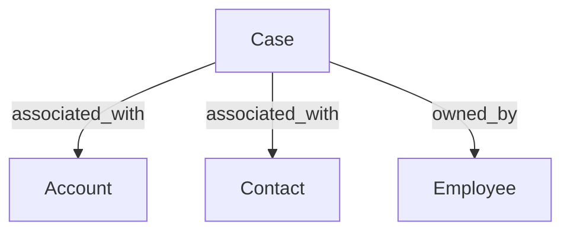

# Case

## Definition

A **Case** is a Salesforce record used to track a customer question, issue, or support request from creation through its lifecycle and resolution.

A Case is associated with an **Account**, a **Contact**, and an **Employee who owns the Case**.

The source captures several types of information about a Case:

- **Identification:** Case Number
- **Case content:** Subject, Description, and Solution
- **Lifecycle information:** Created Date, Closed Date, Last Modified Date, Status, and whether the Case is closed
- **Escalation:** whether the Case is escalated
- **Classification:** Origin, Priority, Case Type, Support Type, and Platform Name
- **Ownership:** Case Owner and Case Owner Email

The source establishes that these attributes are available for Case reporting but does not define the business meaning, allowed values, or interpretation rules for most of the classifications.

## Aliases

- Salesforce Case

## Relationships

`associated_with → Account`

A Case is associated with an Account.

`associated_with → Contact`

A Case is associated with a Contact. The source does not define the Contact's specific business role in relation to the Case.

`owned_by → Employee`

A Case has an owner represented as an Employee. The source also captures the Case Owner's email address.

## Business Rules

- A Case has a **Case Number** in addition to its underlying Salesforce identity.
- A Case contains descriptive information through **Subject** and **Description**.
- A **Solution** may be recorded for the Case.
- Case lifecycle information includes **Created Date**, **Closed Date**, and **Last Modified Date**.
- **Status** and the **Closed** indicator are both tracked for a Case.
- Whether a Case is **escalated** is tracked separately.
- Cases can be classified using **Origin**, **Priority**, **Case Type**, **Support Type**, and **Platform Name**.
- Case ownership is tracked through a Case Owner, with the source relating that owner to an **Employee**.

## Ambiguities

### Case classifications

The source contains the following Case classifications:

- Origin
- Platform Name
- Priority
- Support Type
- Case Type
- Status

However, it does not define:

- the allowed values for these classifications;
- the business meaning of individual values;
- whether any classifications overlap;
- who assigns or maintains them;
- whether their definitions have changed over time.

These classifications should therefore not be given Learning.com-specific interpretations without an additional authoritative source.

### Status and Closed indicator

Both **Status** and a separate **Closed** indicator are available.

The source does not explain:

- which Status values represent a closed Case;
- whether Status and the Closed indicator must always agree;
- which value should be treated as authoritative if they differ.

### Closed Date

A **Closed Date** is captured together with Status and the Closed indicator.

The source does not define the business rules governing Closed Date or how it should be interpreted when evaluating whether a Case is open or closed.

### Escalation

The source indicates whether a Case is **escalated**, but it does not define:

- what qualifies as an escalation;
- how escalation occurs;
- who can escalate a Case;
- whether escalation affects priority, ownership, or status.

### Solution

A **Solution** is captured for a Case, but the source does not explain:

- when a Solution is entered;
- whether it is required for resolved or closed Cases;
- whether it represents the final resolution or another type of support information.

### Contact role

A Case is associated with a **Contact**, but the source does not specify what that relationship means.

For example, the source does not establish whether the Contact is the person who created the Case, reported the issue, is affected by the issue, or serves another role.

### Case Owner

A Case is associated with an **Employee owner**, and the owner's email is also captured.

The source does not define:

- the responsibilities of the Case Owner;
- how ownership is assigned;
- whether ownership can change during the Case lifecycle;
- whether other types of Salesforce Case owners are possible outside the reporting representation described by the source.

### Account references

The source contains both a general Account reference and a Salesforce Account reference.

It does not explain whether these always represent the same business Account, why both are retained, or under what circumstances they could differ. No additional interpretation should be assumed without further business knowledge.

## Related Terms

- **Account** — the Account associated with the Case.
- **Contact** — the Contact associated with the Case.
- **Employee** — the person represented as the Case Owner.

## Ontology Diagram

