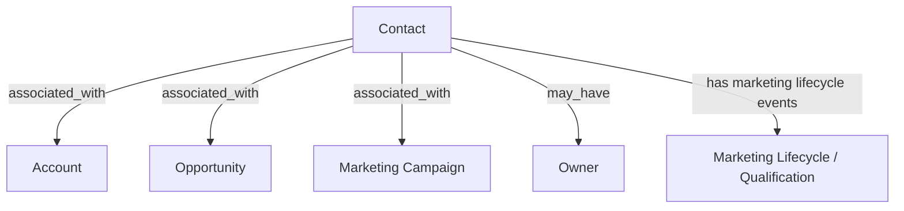

# Contact

## Definition

A **Contact** represents an individual person associated with an **Account**, **Opportunity**, and/or **Marketing Campaign**.

Contacts may originate directly in **Salesforce** or originate in **HubSpot** and be integrated into Salesforce.

Contacts may also contain marketing lifecycle and qualification information, including events such as **MQL**, **SQL**, **Rejected**, and **Returned**.

## Relationships

- `associated_with → Account` — A Contact may be associated with an Account.
- `associated_with → Opportunity` — A Contact may be associated with an Opportunity.
- `associated_with → Marketing Campaign` — A Contact may be associated with a marketing campaign.
- `may_have → Owner` — A Contact may have an assigned owner.

## Business Rules

- A Contact represents an individual person.
- A Contact may be associated with an Account, an Opportunity, a Marketing Campaign, or a combination of these.
- Contacts may originate directly in Salesforce.
- Contacts may also originate in HubSpot and be integrated into Salesforce.
- Marketing lifecycle and qualification events may be recorded for a Contact, including MQL, SQL, Rejected, and Returned events.
- When a Contact exists in both HubSpot and Salesforce, marketing lifecycle or qualification dates may come from both systems and may not be consistent with each other.

## Ambiguities

- Marketing lifecycle and qualification dates are not consistently reconciled between HubSpot and Salesforce when the Contact exists in both systems.
- The authoritative source for conflicting HubSpot and Salesforce marketing dates is not currently defined.
- The business meaning and precedence of individual marketing lifecycle dates are not set

## Related Terms

- **Account**
- **Opportunity**
- **Marketing Campaign**
- **Owner**
- **MQL**
- **SQL**

## Ontology Diagram

