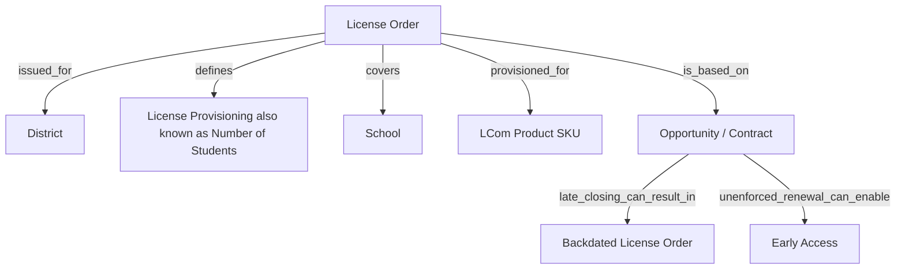

# License Order

## Definition

A **License Order** represents licensing for an LCom organization that has a **District** role in the LCom Platform hierarchy. The order defines the period and quantity of licensing associated with that district and identifies the LCom Product SKU for which the licenses are provisioned.

A License Order includes an owning District-role account, Start and End dates, an indication of whether those dates are enforced, a provisioned number of students, a number of schools, and a list of associated schools. Although schools may be associated with the order, the provisioned number of students is not allocated to individual schools.

The provisioned student quantity should not be interpreted as a fixed number of individual users who are permitted to access the LCom Platform. **License Provisioning** represents how many students Learning.com is paid to serve and is effectively an estimate of the number of students who may potentially use an LCom Product. The number of students who can actually access the platform is not restricted by this provisioned quantity.

For most products, licenses are provisioned in terms of students. For some products, provisioning is instead based on buildings or schools and is converted to a number of users. The conversion rule is unknown and is probably based on enrollment numbers that do not necessarily represent actual users.

License Provisioning is not the same as Active Users: provisioning represents the population Learning.com is paid to serve, while Active Users represent users who have actually begun using the platform.

## Aliases

- **License** — commonly used to refer to licensing represented by a License Order, although the provisioned quantity does not behave like a conventional fixed-seat license.
- **Licenses** — plural usage commonly refers to the provisioned student quantity associated with one or more License Orders.

## Relationships

- `issued_for → District` — A License Order is issued for an LCom organization in a District role in the LCom Platform hierarchy. The District-role account is the owner of the License Order.
- `defines → License Provisioning` — A License Order defines the provisioned number of students that Learning.com is paid to serve. This quantity is an estimate of potential student use rather than a hard access limit.
- `covers → School` — A License Order can contain a number of schools and an associated list of schools. The total License Provisioning is not allocated to individual schools, so the relationship identifies covered schools but does not define a provisioned student quantity for each school.
- `provisioned_for → LCom Product SKU` — Licensing is provisioned per LCom Product SKU.
- `may_be_unenforced_based_on → Opportunity / Contract` — For late-payment renewals, a manual process may unenforce a License Order according to unenforced Opportunities or Contracts in order to provide early access.

## Business Rules

- License Orders are issued at the **District** level of the LCom Platform hierarchy rather than at the individual School level.
- A License Order has an owning District-role account.
- A License Order has Start and End dates.
- A License Order has an indicator specifying whether its Start and End dates are enforced.
- A License Order includes a provisioned number of students, representing License Provisioning.
- A License Order may include a number of schools and a list of associated schools.
- The provisioned number of students is maintained for the License Order as a whole and is **not assigned to specific schools** within the order.
- In most LCom Products, provisioning is expressed per user, specifically per student.
- In some products, provisioning is based on a building or school and is then converted to a number of users.
- The rule used to convert building-based provisioning to a number of users is unknown. It is probably based on enrollment numbers that may not represent actual student use.
- **License Provisioning means how many students Learning.com is paid to serve.** It should therefore be interpreted as an estimated number of students who can potentially use the LCom Product rather than as a count of individually controlled access licenses.
- Enforcement applies to the License Order, including its applicable licensing period. The provisioned student quantity itself does **not** restrict the number of students who can access the LCom Platform.
- Because actual student access is not capped by the provisioned quantity, the number of students using the platform can exceed License Provisioning.
- As a result, calculated license utilization can exceed **100%** in districts where the number of students using the LCom Platform is greater than the provisioned student quantity.
- License data does not provide the provisioned student quantity for each individual school. Therefore, License Provisioning and license utilization cannot be reported accurately at the School level from License Order data alone.
- Licenses are provisioned per **LCom Product SKU**.
- The LCom Product SKU used for licensing is not present in collected Usage data.
- LCom Product SKUs have complex many-to-many relationships with Salesforce products. Because of this, reporting License Orders or License Provisioning by SKU is technically possible but currently has no practical reporting purpose described by the source.
- Late-closing Contracts can result in **backdated License Orders**, causing the reported number of active licenses to change for prior periods.
- For late-payment renewals, there is a manual process to **unenforce License Orders** according to unenforced Opportunities or Contracts so that accounts can receive early access before the renewal is resolved.

## Ambiguities

- **The term “license” can be misleading.** License Provisioning does not represent a conventional individual seat license because the provisioned number of students does not cap or prevent additional students from accessing the LCom Platform.
- **License Provisioning is an estimate rather than a direct measure of actual users.** The source indicates that the ambiguity most likely exists because it is difficult to estimate how many students will actually use the LCom Platform.
- **Building-based provisioning conversion is not defined.** Some products are provisioned per building or school and then converted into a number of users, but the conversion rule is unknown. It is probably based on non-real or estimated enrollment numbers.
- **School-level provisioning is not defined.** A License Order can identify associated schools, but it does not state how the total provisioned student quantity should be divided among those schools. Therefore, a school's provisioned student count cannot be derived accurately from License Order data.
- **License utilization may appear greater than 100%.** This does not necessarily indicate invalid usage because actual access is not limited by the provisioned student quantity and that quantity is itself an estimate.
- **Product-level alignment is complex.** Licensing is associated with an LCom Product SKU, but Usage data does not contain that SKU and the mapping to Salesforce products is many-to-many. The source states that SKU-level licensing reporting is technically possible but does not identify a practical business purpose for it.
- **Historical active-license counts are not necessarily stable.** Late-closing Contracts can create backdated License Orders, which can change the number of licenses considered active in prior periods.
- **Enforcement can be overridden operationally.** License Orders may be manually unenforced for late-payment renewals based on unenforced Opportunities or Contracts to provide early access. The expired unenforced license orders supposed to be enforced back when renewal opportunities are won or lost.
- **License Provisioning vs. Active Users:** Business users may use or interpret these terms as if they represented the same population, but they measure different concepts. License Provisioning is the estimated number of students Learning.com is paid to serve under a License Order. Active Users represent users, mostly students, who have actually started using the LCom Platform. Therefore, License Provisioning should not be interpreted as a count of actual users.

## Related Terms

- **License Provisioning** — The provisioned number of students associated with a License Order; represents how many students Learning.com is paid to serve and is an estimate of potential student use rather than an access limit.
- **District** — The LCom Platform hierarchy role for the organization that owns a License Order.
- **School** — An organization that may be included in the list of schools covered by a License Order. No provisioned student quantity is assigned to an individual School by the License Order.
- **LCom Product SKU** — The product identifier for which licenses are provisioned. It is not present in collected Usage data and has complex many-to-many relationships with Salesforce products.
- **Usage** — Actual use of the LCom Platform. Student Usage can exceed License Provisioning because the provisioned quantity does not restrict access.
- **License Utilization** — A comparison of actual student use with License Provisioning. It can exceed 100% when actual users exceed the estimated provisioned quantity and cannot be calculated accurately by School from License Order data alone.
- **Opportunity / Contract** — Commercial records that can affect License Order timing and enforcement. Late-closing Contracts can produce backdated License Orders, and unenforced Opportunities or Contracts can be used in the manual process that provides early access for late-payment renewals.
- **Backdated License Order** — A License Order created or changed for a prior period because a Contract closed late, resulting in historical active-license counts changing after the fact.
- **Early Access** — Access provided before a late-payment renewal is resolved by manually unenforcing the applicable License Order according to unenforced Opportunities or Contracts.

- **Active User** — A user, mostly a student, who has started using the LCom Platform. Active Users represent actual platform usage, while License Provisioning represents the estimated number of students Learning.com is paid to serve.

## Ontology Diagram

