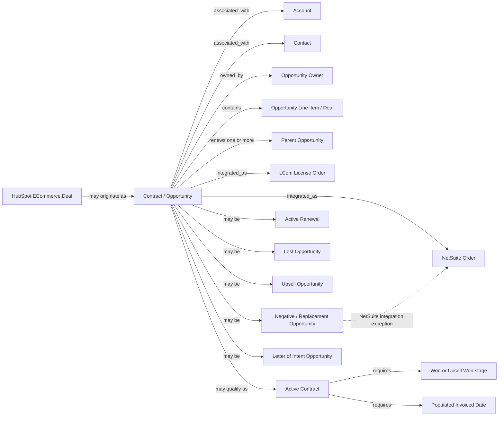

# Contract / Opportunity

## Definition

A **Contract / Opportunity** represents a commercial transaction or potential commercial transaction with an account.

Opportunities originate primarily in Salesforce. Some originate as HubSpot ECommerce deals, with HubSpot acting as the master system for those transactions. Contracts are integrated downstream as NetSuite orders and as license orders in the LCom Platform.

**Opportunity** is the broader lifecycle concept. An opportunity can be won, lost, awaiting renewal, an upsell, a letter of intent, or an adjustment. **Contract** is not fully interchangeable with Opportunity: an opportunity is considered an **Active Contract** when it is in a Won or Upsell Won stage and has an Invoiced Date. Active Contracts contribute to company bookings and ARR.

A Contract / Opportunity normally has an owner, Start Date, End Date, Account, and may have up to three Contacts. Created Date and Close Date are always populated. In practice, Account, Contacts, Start Date, and End Date may be missing or incorrect.

Contracts may be annual, monthly for products whose revenue is annualized, or multi-year. Multi-year contracts may be paid up front or paid progressively by year.

## Aliases

* **Opportunity** — the broader lifecycle record representing the commercial transaction or potential transaction.
* **Salesforce Opportunity** — the primary Salesforce representation of an Opportunity.
* **Contract** — commonly used for a won and invoiced Opportunity that qualifies as an Active Contract; not every Opportunity is a Contract.
* **HubSpot ECommerce Deal** — the originating representation for some ECommerce Opportunities. This is a specific HubSpot term of the word *Deal* and should not be confused with **Opportunity Line Item / Deal**.

## Relationships

* **associated_with → Account** — An Opportunity may be associated with an Account at a school or district role in the account hierarchy. In practice, some Opportunities have no Account.
* **associated_with → Contact** — An Opportunity may have up to three Contacts. Some have none.
* **owned_by → Opportunity Owner** — Opportunities have an owner. The owner also participates in manually maintained commercial attributes such as additional discounts.
* **contains → Opportunity Line Item / Deal** — An Opportunity contains one or more product line items representing the individual deals within the Opportunity. Most Opportunities contain one line item, but an Opportunity may contain multiple line items with different products, revenue classes, or both.
* **renews → Contract / Opportunity** — Opportunities are expected to participate in renewal relationships, but renewal linkage is not complete in practice. One child Opportunity may renew more than one parent Opportunity.
* **integrated_as → NetSuite Order** — Contracts are normally integrated into NetSuite as orders. Negative and replacement adjustment Opportunities are an exception and are not integrated with NetSuite.
* **integrated_as → LCom License Order** — Contracts are integrated into the LCom Platform as license orders.
* **may_originate_as → HubSpot ECommerce Deal** — Some ECommerce Opportunities originate in HubSpot and use HubSpot as their master system. Their renewals are created in Salesforce and loaded back to HubSpot.

## Business Rules

### Opportunity lifecycle

* An Opportunity in a **Won** or **Upsell Won** stage with a populated **Invoiced Date** is considered an **Active Contract** and contributes to company bookings and ARR.
* An Opportunity in a **Lost** stage is considered a **Lost Opportunity**, but it is treated as lost only on or after its Close Date.
* An Opportunity that is neither Won nor Lost is treated as an **Active Renewal**.
* An Active Renewal can remain in that state indefinitely.
* Created Date and Close Date are always populated for Opportunities.
* Only Active Contracts have a populated Invoiced Date under the normal business process.
* Separate Upsell Opportunities may exist and use the **Closed Upsell Won** stage.

### Contract duration and revenue treatment

* Most Contracts are annual.
* Some Contracts are less than 12 months and their revenue is annualized
* Some products use monthly Contracts whose revenue is annualized.
* Contracts may also span multiple years.
* A multi-year Contract may be **Paid-up-front**. In this case, the first year is categorized as ARR and the remaining amount as NRR.
* A multi-year Contract may instead be **Progressive**, with yearly payments categorized as ARR.

### Renewals

* The expected business pattern is for Opportunities to have renewals, but renewal records do not always exist in practice.
* A renewal relationship is not necessarily one-to-one. A child Opportunity may renew more than one parent Opportunity.
* Parent and renewal Opportunities may have different Accounts, Owners, Products, and Contacts.
* Renewal relationships therefore represent commercial continuity but do not imply that all descriptive attributes remain unchanged between generations.

### ECommerce Opportunities

* Some Opportunities originate as HubSpot ECommerce deals.
* HubSpot is the master system for these originating ECommerce transactions.
* A manual confirmation is required to establish that the ECommerce deal has been paid and should proceed further through the pipeline.
* ECommerce renewals are created in Salesforce and loaded back to HubSpot.
* After that point, the renewal may be modified in either Salesforce or HubSpot.
* ECommerce Opportunities are usually relatively small transactions.

### Opportunity composition

* Most Opportunities contain a single Opportunity Line Item / Deal.
* Some Opportunities contain two or more line items.
* Multiple line items may represent:

  * the same product with different classes;
  * different products with the same class;
  * or a combination of different products and different classes.
* An Opportunity can therefore contain more than one commercial type. For example, the same Opportunity may include State Program business, District business, NRR associated with a multi-year arrangement, and Services such as training or support.
* Because commercial class is defined at the Opportunity Line Item / Deal level, an Opportunity should not automatically be assumed to represent only one deal class.

### Upsell versus renewal price increase

* Some Opportunity Line Items may carry an Upsell class within a renewal Opportunity.
* Separating a true Upsell from a renewal price increase requires a complex manual evaluation.
* The decision is made at the Opportunity level using information such as manually ste starting ARR, starting license quantities, renewal license quantities, all relevant Opportunity lines, and previous Account history.
* As a result, reporting Upsell versus Price Increase solely from an individual Opportunity Line Item is possible but is not considered representative of the actual business determination.

### Adjustments, negative Opportunities, and replacements

* When an Active Contract requires a correction or adjustment, a negative or replacement Opportunity may be created.
* These adjustment Opportunities commonly include **NEGATIVE OPP** or **REPLACEMENT OPP** in their names and contain negative amounts.
* They may or may not be connected to the Opportunity being adjusted through a renewal relationship.
* They are placed in Closed Won status.
* They are not integrated with NetSuite.
* They may have an Invoiced Date even when the parent or adjusted Opportunity does not have an Invoiced Date.
* Naming conventions do not identify every adjustment. Some Opportunities may contain negative amounts or renew an adjusting Opportunity using the original Contract's Start and End Dates without containing NEGATIVE OPP or REPLACEMENT OPP in the name.
* Adjustment identification therefore cannot rely exclusively on Opportunity name.

### Backdated Opportunities

* Backdated Opportunities are normal business practice.
* An Opportunity may have a Start Date that occurs before its Invoiced Date.
* Backdating is especially common because some Contracts are paid later in the school year.

### Contract continuation while awaiting renewal

* There is a business process that can keep an existing Contract active indefinitely while payment or renewal is pending.
* Under this process, the Contract's Start and End Dates are effectively ignored for continued access.
* These extended Contracts are manually cleaned up when the renewal Opportunity is eventually won or lost.
* This process contributes to a significant number of backdated transactions.
* Contract dates therefore do not always represent the practical period during which access remains available.

### Letter of Intent Opportunities

* **Letter of Intent Opportunities** are a special Opportunity type.
* They use a small quantity and function as a commitment to purchase additional licenses later.
* Their recorded quantity should therefore not automatically be interpreted as the eventual full purchase quantity.

### License and school counts

* Number of Students, Number of Schools, and the list of schools are manually maintained Opportunity attributes.
* When populated and maintained correctly, they can be treated as representing the number of provisioned licenses and schools in the corresponding license orders.
* These attributes may be empty and are not maintained consistently.
* They should therefore not be assumed to provide complete coverage across all Opportunities.

### Opportunity-level discounts

* Opportunity-level discounting is multi-level.
* Discounts are not applied when the subscription term is shorter than 24 months or when the Contract type is something other than **Paid-up-front** or **Progressive**.
* Other discount types belong to the **Opportunity Line Item / Deal** concept.

## Ambiguities

* **Contract versus Opportunity:** Both terms are close, but they are not exact synonyms. Opportunity is the broader lifecycle object; Active Contract is a qualified state of an Opportunity.
* **Deal terminology:** A **HubSpot ECommerce Deal** represents an Opportunity-level transaction originating in HubSpot, while **Opportunity Line Item / Deal** represents an individual commercial line within an Opportunity. Generic use of *Deal* is used for Opportunities line items, not HubSpot Deals.
* **Opportunity status versus operational access:** Start and End Dates do not always determine whether a customer continues to have access because current Contracts may be extended indefinitely while renewal is unresolved.
* **Date reliability:** Start and End Dates may be missing or incorrect in old imported to Salesforce opportunities and/or Lost opportunities  and legitimate backdated Opportunities are common. Dates should therefore not automatically be interpreted as clean chronological lifecycle boundaries.
* **Renewal completeness:** Renewals are expected for Opportunities, but this expectation is not consistently satisfied.
* **Renewal lineage:** Renewal relationships may be multi-parent, and Accounts, Owners, Products, and Contacts can change between parent and renewal Opportunities. Renewal does not imply attribute continuity.
* **ECommerce system authority:** HubSpot is the master system for originating ECommerce Opportunities, but renewals are created in Salesforce and can later be modified in both systems. The source does not define a single authoritative system for every renewal attribute after this point.
* **Active Contract exceptions:** Under the normal rule, only Active Contracts have an Invoiced Date. Negative and replacement adjustment Opportunities are an explicit exception because they may have an Invoiced Date even when the adjusted parent Opportunity does not.
* **Adjustment identification:** NEGATIVE OPP and REPLACEMENT OPP naming conventions identify many adjustments but not all of them.
* **Upsell versus Price Increase:** Individual line-item classification is insufficient for a representative business determination. The classification depends on the Opportunity as a whole and previous Account history.
* **License and school counts:** Manually maintained Opportunity counts may represent true provisioned quantities when maintained, but they may also be empty or inconsistent.
* **Active Renewal duration:** An Opportunity can remain in an unresolved Active Renewal state indefinitely.

## Related Terms

* **Opportunity Line Item / Deal** — individual commercial line within an Opportunity; maintained as a separate ontology entity.
* **Account** — school or district hierarchy entity associated with an Opportunity.
* **Contact** — person associated with an Opportunity.
* **Opportunity Owner** — person responsible for the Opportunity.
* **Active Contract** — Won or Upsell Won Opportunity with an Invoiced Date.
* **Active Renewal** — Opportunity that is neither Won nor Lost.
* **Lost Opportunity** — Lost-stage Opportunity treated as lost on or after its Close Date.
* **Renewal Opportunity** — child Opportunity continuing one or more parent Opportunities.
* **Upsell Opportunity** — Opportunity representing additional business and potentially using Closed Upsell Won stage.
* **Negative Opportunity** — adjustment Opportunity commonly carrying a negative amount.
* **Replacement Opportunity** — Opportunity used to replace or correct an Active Contract.
* **Letter of Intent Opportunity** — small-quantity commitment representing an intention to purchase more licenses later.
* **HubSpot ECommerce Deal** — HubSpot-originated ECommerce transaction corresponding to an Opportunity-level commercial transaction.
* **NetSuite Order** — downstream order representation of a Contract.
* **LCom License Order** — downstream licensing representation of a Contract in the LCom Platform.
* **ARR** — annual recurring revenue category to which Active Contracts may contribute.
* **NRR** — non-recurring revenue category used for portions of some multi-year Contracts and services like training and support
* **Bookings** — company booking amounts contributed by Active Contracts.
* **State Program Deal** — Biz Dev business represented at Opportunity Line Item / Deal level.
* **District Deal** — ARR business represented at Opportunity Line Item / Deal level.
* **Upsell** — additional recurring business whose distinction from renewal price increase may require Opportunity-level and historical analysis.
* **Price Increase** — renewal increase that may resemble an Upsell at individual line level but is distinguished using broader Opportunity and Account history.

## Ontology Diagram

