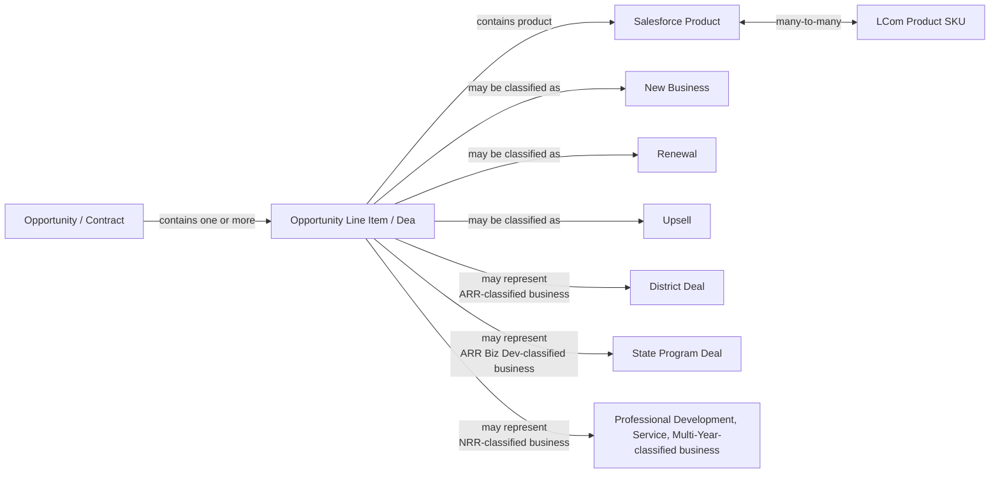

# Opportunity Line Item / Deal

## Definition

An **Opportunity Line Item**, also referred to as an **individual Deal**, is the individual product and revenue component within an Opportunity / Contract.

An Opportunity may contain one or multiple Opportunity Line Items. Most Opportunities contain a single line item, but some contain multiple lines. Multiple lines may represent:

- the same product with different business or revenue classifications;
- different products with the same classification;
- different products with different classifications;
- recurring and non-recurring components of the same Opportunity;
- different portions of a multi-year transaction.

The Opportunity Line Item is the level at which the specific product, pricing, quantity, discount, amount, and **Class** are represented.

The line item inherits major commercial context from its parent Opportunity, including the Opportunity Stage, Start Date, End Date, Invoiced Date, Close Date, and Owner. Its own attributes include the Salesforce product, Class, unit price, list price, total amount, quantity, and discounts.

**Class**  describes both the business nature of the deal and how its revenue is classified. Class can distinguish New Business, Renewal, and Upsell and also distinguish revenue categories such as ARR, Biz Dev, NRR, and multi-year upfront revenue.

Because some classification decisions depend on the entire Opportunity and the Account's previous commercial history, the Class stored on an individual line item does not always fully represent the business interpretation of that line in isolation.

## Aliases

- Opportunity Line Item
- Deal
- Individual Deal
- Product Line Item
- Opportunity Product Line

The term **Deal** is potentially ambiguous. In the context of this ontology, it means an individual Opportunity Line Item. Elsewhere in the business process, a **HubSpot Deal** may represent the Opportunity / Contract itself rather than an individual line item. Generic use of *Deal* is used for Opportunities line items, not HubSpot Deals.

## Relationships

- **part_of → Opportunity / Contract**  
  Every Opportunity Line Item belongs to an Opportunity. The Opportunity provides the broader contractual and sales context for the individual Deal.

- **inherits_commercial_context_from → Opportunity / Contract**  
  The line item inherits Stage, Start Date, End Date, Invoiced Date, Close Date, and Owner from its parent Opportunity.

- **contains_product → Salesforce Product**  
  Each line item represents a Salesforce product.

- **product_maps_to → LCom Product SKU**  
  Salesforce products and LCom product SKUs have a many-to-many relationship. A Salesforce product therefore does not necessarily identify one unique LCom product SKU.

- **coexists_with → Opportunity Line Item / Deal**  
  Multiple line items may belong to the same Opportunity and may have the same or different products and the same or different classifications.

- **may_be_classified_as → New Business**  
  A Deal may represent a first qualifying purchase within the applicable Account / parent Account context.
- **may_be_classified_as → Renewal**  
  A Deal may represent continuation of an existing subscription within its Renewal Time Period.
- **may_be_classified_as → Upsell**  
  A Deal may represent expansion of an existing subscription. Upsell classification can depend on the full Opportunity and Account history rather than the individual line item alone.

- **may_represent → ARR as District Deal**  
  ARR-classified recurring business can represent District business.

- **may_represent → ARR as State Program Deal**  
  Biz Dev-classified business can represent State Program business, generally associated with state initiatives covering eligible organizations such as public districts.

- **may_represent → NRR**    
   Non-Recurring Revenue for products or services not expected to renew annually as Professional Development or Service
- **may_represent → NRR Multi-year**   
   Multi-Year-classified business

## Business Rules

### Line Item Granularity

An Opportunity Line Item is the individual product and revenue component of an Opportunity.

Most Opportunities have one line item, but an Opportunity may contain two or more.

Multiple lines within the same Opportunity may have:

- the same Salesforce product but different Class values;
- different Salesforce products but the same Class;
- different products and different Class values;
- recurring and non-recurring revenue components;
- separate portions of a multi-year transaction.

An Opportunity therefore cannot always be treated as representing one homogeneous Deal type, product, or revenue classification.

### Opportunity-Level Attributes Inherited by the Line Item

Opportunity Line Items inherit the following commercial attributes from the parent Opportunity:

- Stage;
- Start Date;
- End Date;
- Invoiced Date;
- Close Date;
- Owner.

As a result, these attributes describe the parent Opportunity context rather than independently defined line-item events.

If an Opportunity is backdated, adjusted, lost, renewed, or otherwise has unusual timing or status, its line items inherit that context.

### Line-Item-Specific Attributes

An Opportunity Line Item has its own:

- Class;
- Salesforce product;
- unit price;
- list price;
- total amount;
- quantity;
- discounts.

The total amount represents the monetary value attributed to that individual Deal. Its business revenue interpretation depends on its Class and may represent ARR, Biz Dev, NRR, or another applicable multi-year classification.

Quantity represents the number of students associated with the corresponding License Order.

Opportunity-level manually maintained values such as Number of Students, Number of Schools, and lists of schools may be missing or inconsistently maintained and should not automatically be assumed to provide an equivalent representation of the line-item quantity.

### Class as a Line-Item Classification

Class is a business classification stored at the Opportunity Line Item level.

It is used to characterize revenue for financial and accounting reporting and also affects how sales activity is credited and compensated.

Class contains two related dimensions of meaning:

1. **the sales or commercial motion**, such as:
   - New Business;
   - Renewal;
   - Upsell;

2. **the revenue or business category**, such as:
   - ARR;
   - Biz Dev;
   - NRR;
   - Upfront Yr 2&3;
   - Upfront Yrs >3.

Class should therefore not be interpreted simply as a recurring/non-recurring revenue flag.

For example, classifications may conceptually appear as combinations such as:

- New Business : ARR;
- New Business : NRR;
- Renewal : ARR;
- Upsell : ARR;
- Upsell : NRR.

The business meaning is therefore effectively a **combined commercial-motion and revenue-category classification**, even though terminology is not always used consistently.

### ARR

ARR means Annual Recurring Revenue.

ARR is used for products and services that can reasonably be expected to renew.

The underlying subscription does not have to be exactly twelve months long to be classified as ARR. A subscription shorter than twelve months may still be ARR when it is expected to renew.

In the Opportunity / Contract description, ARR-classified business is generally associated with **District Deals**.

### Biz Dev

Biz Dev represents business handled as Business Development, including product transacted under state initiatives.

State Program Deals are generally Biz Dev.

State Program Deals are usually relatively large and may cover usage by eligible organizations such as public districts.

Biz Dev and standard ARR both represent annual recurring revenue from a business perspective, but distinguish different kinds of business.

An Opportunity may contain both State Program / Biz Dev and District / ARR line items.

### NRR

NRR means Non-Recurring Revenue.

NRR is used for products or services not expected to renew annually.

Examples explicitly identified in the source include:

- Professional Development Workshops;
- Webinars;
- Custom Professional Services;
- pilots shorter than twelve months.

NRR can coexist with recurring revenue lines on the same Opportunity.

NRR may also occur as part of a multi-year Opportunity or alongside recurring products and services.

### New Business

New Business is used for a first-time subscription purchase by an Account treated as a prospect.

The determination of New Business is not limited to the individual school or individual line item.

Once the first New Business order has been processed for an Account, additional orders within the same parent Account are expected to be treated as Upsell, even when the later purchase is for a different school.

For example, if one school in a district is processed as New Business, a later order for another school in the same district is treated as Upsell rather than another New Business transaction.

Standalone Professional Development may be classified as **New Business : NRR**, including when purchased independently of a subscription renewal.

### Renewal

Renewal is used for a subscription purchase occurring within the defined Renewal Time Period.

The Renewal Time Period is the calendar year, January 1 through December 31, in which the existing subscription expires.

Renewal value is based on annualized list price without discounting.

The product on a Renewal Opportunity does not have to be identical to the product on the previous Opportunity.

A renewal may use:

- the same product;
- a different product belonging to the same product type;
- a newly designed product replacing an older product.

Individual products of the same broader type may also be created for particular state customers, districts, or commercial customers.

Therefore, product identity alone should not be used to determine whether a Deal represents a renewal.

### Upsell

Upsell represents expansion of an existing subscription for an existing Customer.

The general rule is that Upsell represents the **net positive difference in ARR** between a Renewal Opportunity and the ARR of the source closed-won contract.

A simple price increase is not automatically Upsell.

Increases resulting from factors such as:

- removal of a previous discount;
- prorating differences;
- increases in list price;

are considered price uplift rather than true Upsell.

The practical separation between Upsell and Renewal price increase is complex and involves a manual business process.

The determination can depend on:

- starting ARR;
- renewal ARR;
- previous license counts;
- renewal license counts;
- all Opportunity lines together;
- the Account's previous commercial history.

Some individual line items may therefore contain an Upsell Class alongside Renewal lines, but interpreting Upsell versus Price Increase strictly from an individual product line is not considered representative of the full business decision.

Line-level Upsell reporting is possible, but the authoritative business classification may require Opportunity-level and historical Account context.

### Upsell and Renewal on the Same Opportunity

Upsell and Renewal line items may coexist on the same Renewal Opportunity.

Upsell content below the defined business threshold may be processed together with Renewal content on the same Opportunity.

For managed Accounts, Upsell content at or above the threshold may initially be tracked through a separate Upsell Opportunity so that its pipeline probability can be measured independently.

If the Renewal and Upsell are ultimately purchased together under one purchase order, the Upsell content can be added to the Renewal Opportunity and processed as one transaction and one invoice.

The separate Upsell Opportunity may then be closed using the special Closed-Won Upsell process so the pipeline history is preserved without duplicating the value of the completed transaction.

Therefore, whether Upsell is represented by:

- a line on a Renewal Opportunity;
- a separate Upsell Opportunity;

is partly a sales-process decision and does not by itself change the underlying nature of the Upsell Deal.

### Professional Development and Services

Standalone Professional Development, including Custom Webinar and Onsite Professional Development, has special classification rules.

Standalone PD associated with subscriptions otherwise classified as Renewal is generally classified as **Upsell : NRR**.

An exception exists for Professional Development delivered in subsequent years of progressive multi-year orders, where the PD may be classified as Renewal.

Standalone PD associated with a first-time transaction may be **New Business : NRR**.

**New Business : ARR**

except for standalone Professional Development.

Therefore, the difference between ARR and NRR for a Pilot can depend on duration rather than simply whether money is collected.

### Multi-Year Deals

Multi-year Opportunities may require multiple Opportunity Line Items to represent different portions of the transaction.

For paid-up-front multi-year contracts:

- the first twelve months are generally classified as ARR;
- periods after the first twelve months and through thirty-six months may be classified as **Upfront Yr 2&3**;
- periods beyond thirty-six months may be classified as **Upfront Yrs >3**.

The business source also notes that multi-year pricing for selected products is triggered when the subscription period exceeds fifteen months because standard annual pricing may allow terms of up to fifteen months.

When a multi-year breakout is required, the transaction can therefore be represented by separate line items with different Class values and separate applicable Start and End Dates.

For example, an eighteen-month New Business subscription may be divided into:

- the first twelve months as **New Business : ARR**;
- the remaining six months as **New Business : Upfront Yr 2&3**.

### Progressive Multi-Year Deals

Multi-year contracts may also be progressive rather than paid entirely up front.

Progressive contracts use yearly payments treated as ARR.

Some special Class rules, particularly for Professional Development, differ for subsequent years of progressive transactions.

### Opportunity Line Item Amount

Each Opportunity Line Item has its own total amount.

The meaning of that amount depends on the line's Class.

Depending on classification, the amount may represent:

- standard ARR;
- Biz Dev recurring revenue;
- NRR;
- a multi-year upfront portion.

Opportunity-level totals may therefore combine economically different types of line items.

### Quantity

Opportunity Line Item quantity represents the number of students associated with License Orders.

Some Opportunities, including Letter of Intent Opportunities, may intentionally contain a small quantity because they represent an initial commitment to purchase more licenses later.

Quantity should therefore be interpreted within the commercial context of the parent Opportunity.

### Discounts

Opportunity Line Items can contain two forms of discount information:

1. **Additional Discount**  
   A discount manually entered by the Opportunity Owner, expressed either as a percentage or as a dollar amount.

2. **Total Discount**  
   A broader discount value that incorporates the additional manual discount together with other applicable discount rules.

Discounting is subject to broader Opportunity-level business rules.

Discount values should therefore be understood as part of a multi-level pricing process rather than as a single independently calculated line-item field.

### Mixed Deal Types Within One Opportunity

An Opportunity may simultaneously contain:

- State Program / Biz Dev Deals;
- District / ARR Deals;
- NRR;
- multi-year upfront portions;
- Professional Development or other services;
- Renewal lines;
- Upsell lines.

The Opportunity should therefore not automatically be assigned a single product-line business meaning merely because one of its lines has a particular Class.

Analysis requiring Deal type or revenue type should preserve Opportunity Line Item granularity unless a defined Opportunity-level business rule explicitly determines the classification.

## Ambiguities

### Deal Terminology

The term **Deal** is overloaded.

In this ontology, Deal means an Opportunity Line Item.

However, the source also refers to **HubSpot ECommerce Deals**, which correspond to Opportunity / Contract-level transactions rather than necessarily to individual product line items.

Generic use of Deal is used for Opportunities line items, not HubSpot Deals..

### Meaning of Class

The most consistent interpretation is that Class represents a combined classification containing both:

- the commercial motion;
- the revenue/business category.

### Number of Class Subcategories is 5

- ARR;
- Biz Dev;
- NRR;
- Upfront Yr 2&3;
- Upfront Yrs >3.

### Upsell Versus Price Increase

Although Upsell can be assigned at the line-item level, the distinction between true Upsell and Renewal price increase is not reliably determined from one line alone.

The business process can evaluate all Opportunity lines together and use historical ARR and license information from the Account.

Consequently, line-level reporting of Upsell versus Price Increase is possible but may not represent the final business interpretation.

### New Business Versus Upsell Grain

New Business is based partly on whether previous New Business has already occurred within the Account / parent Account context.

A purchase by a new school is therefore not necessarily New Business if another school within the same parent Account has already completed the initial New Business transaction.

The exact organizational grain used in every exceptional Account hierarchy scenario is not further defined in the supplied source.

### Revenue Classification of State Program Business

Both Biz Dev and ARR are Annual Recurring Revenue but  different types of business.

Therefore, **ARR as an economic concept** is broader than the specific **ARR Class/subcategory** used to distinguish District Deals from Biz Dev / State Program Deals.

This distinction should be preserved in reporting and reasoning.

### Multi-Year Breakout Thresholds

The source contains two related multi-year concepts:

- periods after the first twelve months may be classified as Upfront Yr 2&3;
- for selected products, standard annual pricing can cover up to fifteen months and multi-year pricing is triggered only for periods over fifteen months.

These statements describe different aspects of the classification and pricing process and should not be collapsed into a single twelve-month threshold rule without additional business clarification.

### Product Continuity

A renewal may use a different Salesforce Product from the previous transaction while still representing continuation of the same product type.

Additionally, Salesforce Product and LCom Product SKU have a many-to-many relationship.

Therefore, exact product equality is insufficient to establish whether two Deals represent continuity, replacement, or genuinely different product business.

### Opportunity-Level Versus Line-Level Meaning

Some business attributes are physically represented at the Opportunity Line Item level while the underlying business decision is made at Opportunity or Account level.

Upsell classification is the clearest documented example.

## Related Terms

- **Opportunity / Contract** — Parent commercial transaction containing one or more Opportunity Line Items.
- **Salesforce Product** — Product represented directly on the Opportunity Line Item.
- **LCom Product SKU** — Product identifier used in the LCom product context; related many-to-many with Salesforce Product.
- **District Deal** — Recurring business generally represented with ARR classification.
- **State Program Deal** — Biz Dev business associated with state-level initiatives and eligible organizations.
- **New Business** — First qualifying purchase within the applicable Account / parent Account context.
- **Renewal** — Purchase associated with continuation of an existing subscription within the Renewal Time Period.
- **Upsell** — Expansion of an existing subscription representing net positive ARR beyond the prior contract, excluding ordinary price uplift.
- **Price Increase / Price Uplift** — Increase caused by factors such as discount removal, prorating, or list-price increase rather than true expansion.
- **ARR** — Renewable revenue category; also a broader revenue concept that can include both District and Biz Dev recurring business.
- **Biz Dev** — Revenue/business category used for Business Development transactions such as State Program Deals.
- **NRR** — Non-Recurring Revenue for products or services not expected to renew annually.
- **Upfront Yr 2&3** — Classification for applicable later portions of paid-up-front multi-year transactions.
- **Upfront Yrs >3** — Classification for applicable paid-up-front periods beyond thirty-six months.
- **Win Back** — Return of a previously churned Customer; generally associated with New Business in documented cases, subject to late-renewal exceptions.
- **License Order** — Downstream licensing transaction whose student quantity corresponds to Opportunity Line Item quantity.
- **Letter of Intent Opportunity** — Special Opportunity representing a commitment to purchase additional licenses later and potentially containing a small initial quantity.
- **Negative Opportunity** — Adjustment transaction that may contain negative Deal amounts.
- **Replacement Opportunity** — Transaction used to replace or correct an existing Active Contract.
- **Professional Development (PD)** — Service category subject to special New Business, Renewal, Upsell, and NRR classification rules.

## Ontology Diagram

