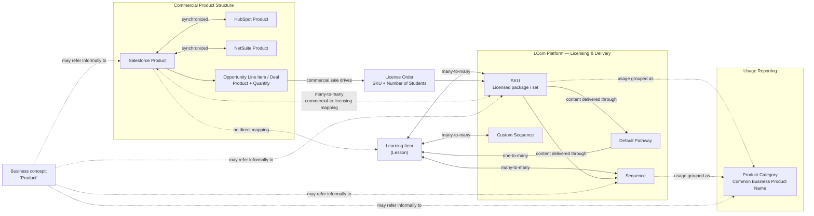

# Product

## Definition

**Product** is a commonly used business concept for LCom offerings, but it does not currently have one conformed definition across business systems, licensing, learning content, and reporting.

At the content level, the fundamental learning item is a **Lesson**. Lessons are grouped into **SKUs**, which are the units licensed in the LCom Platform. Licensed lessons are then made available through **Sequences** and a **Default Pathway**. Users may also create **Custom Sequences** from available learning content.

The commercial process uses a different product structure. Salesforce Opportunities contain **Opportunity Line Items / Deals** associated with Salesforce Products and the quantity purchased. This information is used to create **License Orders** in the LCom Platform, where licensing is represented by SKUs and the number of students provisioned. Because Salesforce Products and SKUs represent different stages and purposes in this process, their relationship is many-to-many rather than a one-to-one product mapping.

HubSpot and NetSuite also maintain their own Product definitions, synchronized with Salesforce Products.

Business users generally do not distinguish these system-specific meanings when they say **Product**. They commonly use familiar product names and expect those names to represent approximately the same offering across sales, licensing, usage, and other business contexts, even when no precise equivalent exists in a particular system.

## Aliases

Business users may refer to products using:

- Full commonly used product names.
- Abbreviations based on the first characters of a product name, such as **DLA** for Digital Literacy Assessments or **ET** for EasyTech.
- Similar, shortened, or informal versions of a product name.

Commonly used product names include:

- AI Literacy
- Digital Literacy Assessments
- Common Sense Education
- Digital Readiness
- Digital Safety Foundation
- EasyCode
- EasyTech
- Keyboarding
- Online Safety & Digital Citizenship
- Tech Quest

These names are business-facing concepts rather than guaranteed identifiers of a single corresponding Salesforce Product, SKU, Sequence, or other system object.

## Relationships

- **composed_of → Lesson**  
  Learning content is fundamentally made up of individual lessons.

- **grouped_into → SKU**  
  Lessons are grouped into SKUs for licensing in the LCom Platform.

- **many_to_many → SKU**  
  Lessons and SKUs have a many-to-many relationship: a SKU can include multiple lessons, and a lesson can participate in multiple SKUs.

- **distributed_through → Sequence**  
  Lessons available through licensed SKUs can be organized and delivered through sequences.

- **distributed_through → Default Pathway**  
  Licensed learning content can also be delivered through the default pathway.

- **distributed_through → Custom Sequence**  
  Users can create custom sequences from learning content available to them.

- **many_to_many → Sequence**  
  Lessons, SKUs, and sequences participate in many-to-many relationships.

- **used_in → Opportunity Line Item / Deal**  
  Salesforce Products are associated with Salesforce Opportunity Line Items representing what is sold.

- **drives_provisioning_of → License Order**  
  Salesforce Opportunities and their Opportunity Line Items provide the commercial basis for creating License Orders in the LCom Platform.

- **uses → SKU**  
  License Orders use SKUs to determine which learning content is licensed.

- **specifies → Licensing Provisioning / Number of Students**  
  License Orders include the number of students to be provisioned for licensed access.

- **many_to_many → SKU**  
  Salesforce Products and LCom Platform SKUs have a many-to-many relationship. A commercial Product does not map directly to a single licensing SKU.

- **synchronized_with → HubSpot Product**  
  HubSpot maintains its own Product definition synchronized with Salesforce Products.

- **synchronized_with → NetSuite Product**  
  NetSuite maintains its own Product definition synchronized with Salesforce Products.

- **classified_for_usage_as → Product Category**  
  Product Categories provide a reporting structure for grouping usage according to commonly recognized business product names.

- **aggregated_by → Salesforce Sub Family**  
  Salesforce Products can be grouped into Sub Families for commercial reporting.

## Business Rules

- A **Lesson** is the base learning-content unit.

- Only **SKUs** are licensed in the LCom Platform.

- Sequences and the Default Pathway are ways of organizing and delivering lessons from licensed content; they are not independently sold or licensed products.

- Users can create their own Custom Sequences from learning content available to them.

- Salesforce Opportunities contain Opportunity Line Items associated with Salesforce Products and purchased quantities.

- The commercial information represented by Salesforce Opportunities and Opportunity Line Items is used to create License Orders in the LCom Platform.

- License Orders use SKUs and the number of students to represent licensing provisioning.

- Salesforce Products and LCom Platform SKUs have a many-to-many relationship and should not be treated as equivalent concepts.

- There is no direct relationship between Salesforce Products and individual Lessons.

- Salesforce Products and SKUs can be created specifically for a particular state or LCom Customer.

- HubSpot and NetSuite maintain their own Product definitions, synchronized with Salesforce Products.

- **Product Categories** were created for reporting usage according to commonly used product names. They do not exist as Product Categories in the LCom Platform.

- Product Categories are manually maintained classifications of Learning Items. A Learning Item may belong to more than one Product Category.

- Product Categories are therefore not mutually exclusive, and usage measures aggregated across Product Categories are not necessarily additive.

- Usage can be reported by Product Category.

- Revenue cannot be reported using these usage Product Categories.

- Revenue can be reported using the Salesforce commercial product structure.

- Usage cannot be reported directly by Salesforce Product.

- Although a Learning Item may be associated with one or more SKUs, an individual Usage event does not identify which licensed SKU actually provided access to that Learning Item. As a result, Usage cannot be reliably attributed to a specific active licensed SKU or to the Salesforce Product behind that license.

- **Salesforce Sub Family** is the closest commercial aggregation level to some commonly recognized product groupings, but it is less granular than usage Product Categories.

- One Salesforce Sub Family may combine several business Product Categories.

- Salesforce also contains Sub Families for products sold by LCom whose usage is not provided through the LCom Platform, including products acquired from other companies.

- Therefore, Salesforce Sub Family is not equivalent to an LCom usage Product Category and cannot be used as a direct replacement for it.

## Ambiguities

### Meaning of Product

The business term **Product** does not currently refer to one consistently defined object.

Business users commonly operate with familiar names such as EasyTech, EasyCode, or Digital Literacy Assessments and generally assume that the same business product exists across the relevant systems and processes.

They do not normally distinguish between:

- the exact Salesforce Product used in a sale;
- the corresponding HubSpot or NetSuite Product;
- the SKU or combination of SKUs required for licensing;
- the way lessons are organized into sequences or a default pathway;
- or the reporting grouping used to describe usage.

As a result, the business meaning of Product can be broader than any individual system's Product definition.

### Product Names vs. System Objects

A familiar business product name does not necessarily correspond to one uniquely defined object in every system.

The same business offering may involve:

- one or more Salesforce Products;
- one or more SKUs;
- multiple Sequences;
- a Default Pathway;
- and a reporting Product Category.

A **Sequence** may therefore be perceived by a business user as part of a Product or even referred to informally as a Product, but operationally it is a way of organizing and distributing lessons rather than something independently sold or licensed.

### Commercial Product vs. Licensed Content

The sales process and licensing process describe the offering differently.

Salesforce records what was sold using Products, Opportunity Line Items, and purchased quantities. The LCom Platform provisions access using License Orders, SKUs, and numbers of students.

The conversion from the commercial representation to the licensing representation is not one-to-one.

### Revenue vs. Usage

Revenue and usage do not currently share a conformed product hierarchy.

The Salesforce Product structure supports commercial and revenue reporting but does not directly identify the lessons whose usage should be attributed to the product.

Although Learning Items can be associated with SKUs, an individual Usage event does not identify which purchased or licensed SKU provided access to the Learning Item. Therefore, Usage cannot be reliably traced from an individual Usage event back to a specific active licensed SKU or Salesforce Product.

The usage Product Category structure groups learning activity into familiar business product names, but those categories do not represent the commercial products used for revenue reporting. Product Categories are manually maintained and may overlap because the same Learning Item can belong to more than one category, so usage totals across Product Categories are not necessarily additive.

Therefore, a request such as **"revenue and usage by product"** is ambiguous unless the intended Product definition and acceptable mapping between the two perspectives are established.

### Product Continuity

A renewal does not have to use exactly the same Salesforce Product as the previous transaction. It may use the same Product, a different Product belonging to the same broader product type, or a newly designed Product that replaces an older one.

Exact Salesforce Product equality is therefore insufficient to determine whether two Deals represent continuation of the same business Product, a replacement Product, or genuinely different product business. Product continuity must be understood at a broader business level than the individual Salesforce Product record.

### Salesforce Sub Family

Salesforce Sub Family provides a broader commercial grouping than the Product Categories used for LCom Platform usage.

A single Sub Family may contain several usage Product Categories. Salesforce also contains Sub Families representing products sold by LCom whose usage is not delivered or captured through the LCom Platform.

For this reason, Sub Family cannot serve as a direct conformed product grouping between revenue and platform usage.

## Related Terms

- **Lesson / Learning Item** — the fundamental unit of learning content.
- **SKU** — the unit through which learning content is licensed in the LCom Platform.
- **Sequence** — an ordered organization of lessons used to distribute licensed learning content.
- **Custom Sequence** — a sequence created by users from learning content available to them.
- **Default Pathway** — the standard organization through which licensed lessons can be delivered.
- **Salesforce Product** — the commercial product definition used in Salesforce sales activity.
- **HubSpot Product** — HubSpot's Product definition, synchronized with Salesforce Products.
- **NetSuite Product** — NetSuite's Product definition, synchronized with Salesforce Products.
- **Opportunity Line Item / Deal** — the component of a Salesforce Opportunity that identifies the Salesforce Product and quantity being sold.
- **License Order** — the LCom Platform representation of licensed access created from the commercial sale and expressed through SKUs and licensing provisioning.
- **Licensing Provisioning / Number of Students** — the number of students for whom access is provisioned through a License Order.
- **Product Category** — a manually maintained reporting-only classification used to report LCom Platform usage under commonly recognized business product names. A Learning Item may belong to more than one Product Category, so categories can overlap and their usage totals are not necessarily additive.
- **Salesforce Sub Family** — a broader Salesforce commercial product grouping that may contain several usage Product Categories or products whose usage does not occur in the LCom Platform.

## Ontology Diagram

