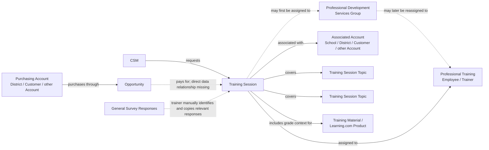

# Training Session

## Definition

A **Training Session** is a Learning.com professional training activity recorded in the Salesforce Training Session object. It represents a planned or delivered training engagement for an Account and captures the people responsible for it, the training content, timing and delivery details, attendance-related information, implementation context, and post-training feedback.

A Training Session is a business activity, not necessarily a direct representation of the commercial transaction that pays for it. Training may be purchased by one Account, such as a District or Customer, but delivered for one or more different Accounts, such as individual Schools. The Salesforce Training Session data does not define a direct relationship to the Opportunity used to pay for the training.

## Relationships

`associated_with → Account`

A Training Session is associated with an Account. The Account can be at any relevant Account hierarchy role, including a School, District, Customer, or another Account level. The associated Account identifies the Account the Training Session is related to and does not necessarily identify the Account that purchased the training.

`requested_by → CSM`

A Training Session is requested by a **Customer Success Manager (CSM)**.

`initially_assigned_to → Professional Development Services Group`

A Training Session may first be assigned to a professional training or services group before a specific trainer is selected.

`assigned_to → Professional Training Employee`

A Training Session may later be reassigned from the group to a specific professional training employee who is responsible for the session.

`covers → Training Session Topic`

A Training Session can cover **multiple Training Session Topics**. The same Topic can also appear in multiple Training Sessions, allowing topic coverage to be analyzed across sessions.

`paid_through → Opportunity`

A Training Session is paid for through an Opportunity. This is a business relationship, but a direct relationship between Training Session and Opportunity is **not defined in the Salesforce Training Session data**.

An Opportunity associated with a higher-level Account, such as a District or Customer, may pay for multiple Training Sessions delivered for different Accounts, including individual Schools. A Training Session can also be associated with the same Account that purchases and pays for it.

## Business Rules

- A Training Session is associated with an Account, but the associated Account and the Account paying for the training do not have to be the same.
- A higher-level Account can purchase training for lower-level Accounts in its hierarchy.
- One Opportunity may fund more than one Training Session, including sessions associated with different Schools.
- A Training Session may be requested by a CSM, initially assigned to a professional services or training group, and later reassigned to a specific professional training employee.
- A Training Session can cover multiple Topics.
- Training Session information can include timing, location, participation method, contacts, attendance, training classification, implementation information, notes, and post-training observations.
- Grade-related information describes the grade levels relevant to the training material or Learning.com products being discussed or implemented. It should not automatically be interpreted as a precise record of the actual grades represented by attendees.
- Training Session attributes are populated manually in Salesforce.
- Because the information is manually entered, values may be incomplete, inconsistent, or interpreted differently by different users.
- Post-training survey information stored on a Training Session is also manually maintained.
- There is no dedicated SurveyMonkey survey record directly linked to each Training Session.
- Trainers review responses from a general survey, determine which responses belong to a particular Training Session based on the answers, and manually copy the relevant information into the Salesforce Training Session record.
- Survey information on the Training Session should therefore be treated as manually matched and manually transcribed feedback rather than as a system-enforced one-to-one survey-to-session relationship.

## Ambiguities

- **Associated Account vs. paying Account:** The Account attached to the Training Session may represent the Account receiving or otherwise associated with the training, while a different Account may have purchased the training through an Opportunity.
- **Opportunity relationship is missing from the Training Session data:** Training Sessions are paid for through Opportunities, but the direct relationship needed to trace a Training Session to the paying Opportunity is not defined in the available Salesforce Training Session data.
- **One purchase can support several Accounts:** A District or Customer may purchase training that results in multiple Training Sessions associated with different Schools. The commercial relationship and the delivery relationship are therefore not necessarily one-to-one.
- **Group assignment vs. trainer assignment:** A Training Session may first belong to a professional training group and later be reassigned to an individual trainer. The current assignment may not describe the complete assignment history.
- **Topics are multi-valued:** A Training Session is not limited to one Topic. Any analysis that treats a session as having a single Topic would lose information.
- **Grade meaning:** Grade-related attributes are connected to the material or products addressed in the training and should not automatically be interpreted as actual attendee grade levels.
- **Survey responses are not directly linked:** SurveyMonkey does not provide a dedicated survey relationship for each Training Session in this process. Trainers manually determine which general survey responses belong to a session before copying them into Salesforce.
- **Survey transcription can introduce uncertainty:** Because responses are manually identified and copied, the Salesforce Training Session record may contain omissions, transcription differences, or responses associated incorrectly with a session.
- **Manual data entry:** Training Session attributes are manually populated, so naming, categorization, attendance, notes, implementation details, survey details, and other values can be inconsistent across records.
- **Attribute values:** The existence and business purpose of the attributes are important, but the specific allowed values and classifications are not currently defined as stable ontology rules.

## Related Terms

- **Account** — the Account associated with the Training Session. It may or may not be the Account that purchased the training.
- **School** — a possible Account associated with a Training Session delivered for a specific School.
- **District** — may receive training directly or purchase training that is delivered through sessions associated with individual Schools.
- **Customer** — may purchase training for itself or for lower-level Accounts in its hierarchy.
- **CSM (Customer Success Manager)** — the employee who requests the Training Session.
- **Professional Development Services Group** — a group to which a Training Session may be assigned before a specific trainer is selected.
- **Professional Training Employee / Trainer** — the individual professional training employee assigned to deliver or manage the Training Session.
- **Opportunity** — the commercial transaction used to pay for training. The business relationship exists even though a direct Training Session-to-Opportunity relationship is not defined in the available data.
- **Training Session Topic** — a Topic covered by a Training Session. One Training Session may cover multiple Topics.
- **Learning.com Product** — training material may relate to Learning.com products and the grade levels relevant to those products.
- **SurveyMonkey Survey Response** — feedback collected through a general survey and manually matched and copied into the relevant Training Session record.

## Ontology Diagram

