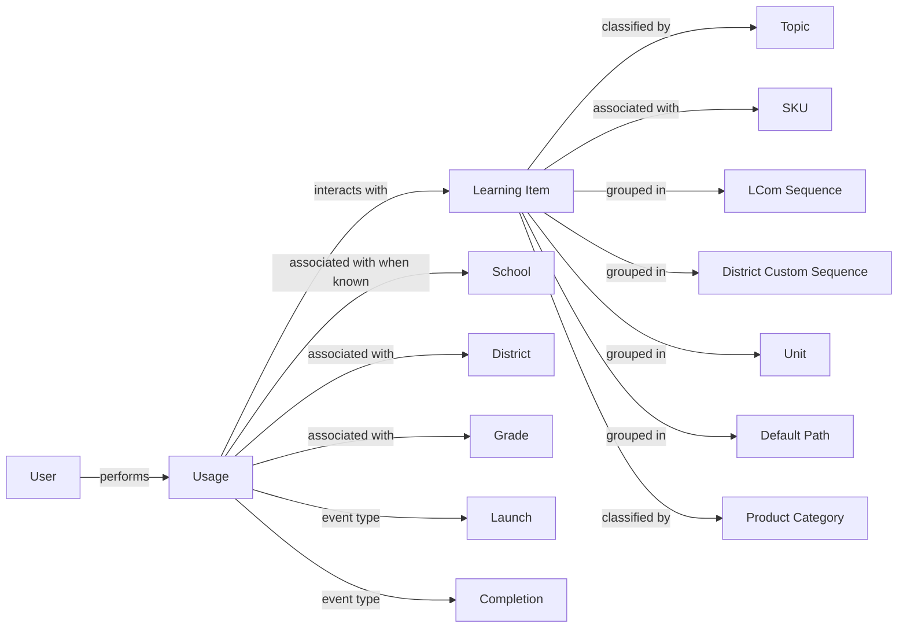

# Usage

## Definition

**Usage** is an interaction by a **User** with a **Learning Item** in the **LCom Platform**. Usage is represented by individual events such as a **Launch** or a **Completion**.

A Usage event occurs at a point in time and is associated with a User, a Learning Item, an organizational place, and a Grade. The organizational place is usually a School when the School is known. When the School is not available, the event can be associated with the District instead.

Launches and Completions are event types within Usage rather than separate top-level business entities. A User may generate more than one Launch or Completion for the same Learning Item.

Learning Items can be organized in multiple independent ways, including **Topic**, **SKU**, **LCom Sequence**, **District Custom Sequence**, **Unit**, **Default Path**, and manually maintained **Product Category**. These are different classifications, groupings, or aggregations of Learning Items and do not form a single hierarchy.

## Aliases

- **Usage Data** — data representing individual Usage events.
- **Usage Event** — an individual interaction event, such as a Launch or Completion.

## Relationships

- `performed_by → User` — each Usage event is generated by a User, such as a student, teacher, or district coordinator.
- `interacts_with → Learning Item` — each Usage event represents interaction with a specific Learning Item.
- `associated_with → School` — a Usage event can be associated with a School when the School is known.
- `associated_with → District` — the District is known even when the School is not available, allowing the Usage event to remain associated with an organizational place.
- `associated_with → Grade` — Usage includes a Grade value used to describe the grade context of the event. Grade can be Unknown when the value is missing.
- `has_event_type → Launch` — a Launch is a type of Usage event representing the launch of a Learning Item.
- `has_event_type → Completion` — a Completion is a type of Usage event representing completion activity related to a Learning Item, such as successfully answering a question or resolving another task related to the lesson.

### Learning Item classification and grouping relationships

The following relationships describe independent ways in which Learning Items can be classified, grouped, or aggregated. They do not imply relationships among the classification concepts themselves.

- `classified_by → Topic` — a Learning Item belongs to one Topic. All Usage events for the same Learning Item therefore belong to the same Topic.
- `associated_with → SKU` — a Learning Item may be associated with one or more LCom SKUs.
- `grouped_in → LCom Sequence` — a Learning Item may be included in an LCom-defined Sequence.
- `grouped_in → District Custom Sequence` — a Learning Item may be included in a Sequence created or customized for a District.
- `grouped_in → Unit` — a Learning Item may be grouped into a Unit.
- `grouped_in → Default Path` — a Learning Item may be included in a Default Path used to organize or present content in the LCom Platform.
- `classified_by → Product Category` — a Learning Item may be assigned to one or more manually maintained Product Categories.

There is no implied hierarchical or direct relationship between **Topic**, **SKU**, **LCom Sequence**, **District Custom Sequence**, **Unit**, **Default Path**, and **Product Category**. They represent different ways of organizing the same underlying Learning Items.

## Business Rules

- Usage is recorded as individual interaction events rather than as a single accumulated value.
- A User may have multiple Launches or Completions for the same Learning Item.
- Each Learning Item belongs to one Topic, so Topic is determined by the Learning Item rather than by the individual Usage event.
- A School may be missing for a Usage event. In that case, the event can still be associated with the known District.
- Grade is part of the Usage context and can be **Unknown** when the grade value is missing.
- A User has an individual identifier across the LCom Platform, but the same identifier may or may not be preserved when a student moves from one School to another and continues using the platform.
- A Learning Item may participate in more than one classification or grouping scheme at the same time.
- A Learning Item may belong to more than one manually maintained Product Category.
- Product Categories are therefore not mutually exclusive, and measures aggregated across Product Categories are not additive.
- There is no reliable way to determine, from an individual Usage event, which Salesforce Product from an active contract or which licensed LCom SKU provided access to the Learning Item.
- The number of **unique Users** is a non-additive measure across organizational levels. A User can appear in more than one School, so summing School-level unique-user counts does not necessarily equal the exact distinct-user count for a District, State, Country, or the whole company.
- For higher-level analysis, summing the unique-user counts calculated separately for each School is considered an acceptable approximation for District, State, Country, and whole-company totals. The observed difference from the exact distinct-user count is at most approximately **2%** and is considered negligible for this use.

## Ambiguities

- A Usage event may have no School even though its District is known. The reason is not currently established. Possible causes such as login method or platform-side behavior have not been confirmed and should not be treated as business rules.
- A User identifier may or may not remain the same when a student moves between Schools. Because of this, User continuity across School changes is not guaranteed.
- Learning Items can be associated with multiple structures such as SKU, Sequence, Unit, Default Path, Topic, and Product Category, but these structures should not be interpreted as levels of one common hierarchy.
- An association between a Learning Item and an SKU does not identify which purchased or licensed SKU caused a specific Usage event. Usage therefore cannot be reliably attributed to a particular active Salesforce Product or licensed SKU at the individual-event level.
- Manually maintained Product Categories can overlap because the same Learning Item may belong to more than one category. Totals across categories can therefore double-count the same underlying Usage.

## Related Terms

- **User** — the person interacting with the LCom Platform.
- **Learning Item** — the lesson or other learning content involved in a Usage event.
- **Launch** — a Usage event in which a Learning Item is launched.
- **Completion** — a Usage event representing completion activity associated with a Learning Item.
- **School** — the School associated with a Usage event when available.
- **District** — the District associated with a Usage event and the fallback organizational place when School is not available.
- **Grade** — the grade context associated with Usage; it may be Unknown.
- **Topic** — a classification in which each Learning Item belongs to one Topic.
- **SKU** — one way of associating or grouping Learning Items; it does not by itself identify the licensed source of an individual Usage event.
- **LCom Sequence** — an LCom-defined grouping or ordering of Learning Items.
- **District Custom Sequence** — a District-specific grouping or ordering of Learning Items.
- **Unit** — another grouping of Learning Items.
- **Default Path** — a platform-defined path used to organize or present Learning Items.
- **Product Category** — a manually maintained classification of Learning Items. Categories can overlap.
- **Product** — a broader business concept related to what is sold or licensed. Product structure and Product ontology are maintained separately from Usage.
- **Active User** — a derived metric based on User activity. Its calculation belongs in the semantic layer rather than in the Usage ontology.

## Ontology Diagram

The Learning Item branches in the diagram represent separate classification, grouping, or aggregation structures. They should not be read as a hierarchy or as implying relationships between Topic, SKU, Sequence, Unit, Default Path, and Product Category.
