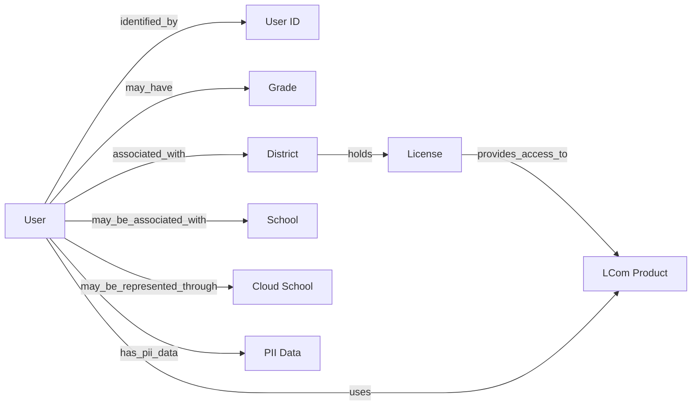

# User

## Definition

A **User** is a student, teacher, or district coordinator using an LCom Product.

Each User has an individual **User ID** in the LCom Platform. The User ID may remain the same when a User moves from one school to another, but preservation of the same ID across such moves is not guaranteed.

Users are associated with a district, which holds the licenses used to access LCom Products. Students and teachers may also be associated with a school within that district in the usage data. District coordinators do not have a regular school association; in some cases, special schools identified with names containing `_cloud` or `_Cloud` are used to represent district-level users or activity.

A User may therefore be associated with different schools or districts over time.

A student User may have a **Grade**. Grade may reflect the student's current or historical grade based on enrollment and usage data.

User PII, such as names or email addresses, is available in the LCom Platform but is not currently used for internal LCom business reporting.

For internal LCom business reporting, platform usage is associated with individual User IDs and is used primarily for aggregate, high-level reporting. This reporting context is distinct from LCom Platform reporting provided directly to teachers, such as grade books, where individual User identity may be relevant.

## Relationships

- `associated_with` → **District** — Every User is associated with a district. Districts hold the licenses used by Users.
- `may_be_associated_with` → **School** — Students and teachers may be associated with a school within their district.
- `identified_by` → **User ID** — Each User has an individual identifier in the LCom Platform.
- `may_have` → **Grade** — A student User may have a current or historical grade associated with usage data based on enrollment and usage information.
- `uses` → **LCom Product** — Users access and use LCom Products under licenses held by their district.
- `has_pii_data` → **PII Data** — User PII, such as names or email addresses, is available in the LCom Platform but is not currently used for internal LCom business reporting.

## Business Rules

- A User is a **student, teacher, or district coordinator**.

- Every User is associated with a **district**, because licenses are held at the district level.

- Students and teachers may additionally be associated with a **school**.

- District coordinators do not have a regular school association. Special schools with names containing `_cloud` or `_Cloud` may be used to represent district-level users or their activity.

- A User can be associated with more than one school or district **over time**, for example when a student moves from one school to another.

- A User ID may remain unchanged after a User moves between schools, but continuation of the same User ID is not guaranteed.

- Because the same User ID can occur under different schools over time, aggregating distinct Users independently at the school level is not equivalent to counting distinct Users at the district level:

  `SUM(COUNT DISTINCT User ID by School) ≠ COUNT DISTINCT User ID by District`

- The observed difference between these approaches is less than approximately **2%** and is considered negligible for current high-level internal LCom business reporting.

- A student may have a **Grade** associated with usage data.

- Grade may be current or historical and can reflect enrollment and usage information from previous enrollments.

- User PII is not currently used for internal LCom business reporting.

- Internal LCom business reporting uses User IDs primarily for aggregate usage and user-count metrics rather than individual-level reporting.

- Internal LCom business reporting should be distinguished from reporting available inside the LCom Platform for teachers, such as grade books, where individual student or teacher identity may be relevant.

## Ambiguities

- Preservation of the same User ID when a User moves from one school or district to another is not guaranteed. The source does not define the conditions under which an existing User ID is retained versus a new User ID being created.

- Special `_cloud` or `_Cloud` schools are used for district-level users or activity, but  all conditions governing when such a school is created or used are unclear.

## Related Terms

- User ID
- Grade
- Student
- Teacher
- District Coordinator
- School
- District
- License
- LCom Product
- LCom Platform
- Platform Usage
- PII Data

## Ontology Diagram

